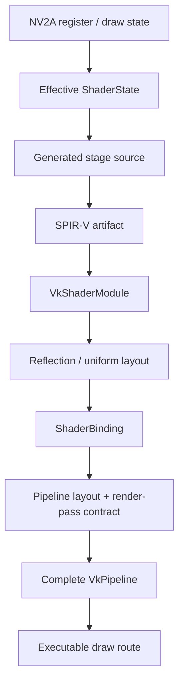

# Vulkan Shader Binding & Compilation

This page explains how xemu turns NV2A draw state into reusable Vulkan shader and graphics-pipeline objects. The key architectural fact is that source, SPIR-V, shader modules, shader bindings and graphics pipelines are separate reuse layers.

A graphics-pipeline miss does not prove that a shader was compiled. A shader module becoming available does not prove that a draw can execute without blocking.

For first-seen fallback research, continue with [[Vulkan Ubershader & Hybrid Specialization|Vulkan-Ubershader-and-Hybrid-Specialization]]. For a project-independent process, see [[Hybrid Shader Research Guide|Hybrid-Shader-Research-Guide]].

## Artifact ladder



These readiness levels must not be collapsed:

```text
source known
    != SPIR-V cached
    != module ready
    != binding ready
    != pipeline ready
    != draw executable
```

## Normal specialized flow

```text
extract ShaderState
    ↓
shader-binding cache hit?
    ├─ yes → reuse stage selections and metadata
    │
    └─ no → resolve vertex / geometry / fragment module keys
              ↓
            module cache hit?
              ├─ yes → reuse module
              └─ no → generate GLSL
                       → persistent SPIR-V lookup
                       → glslang when needed
                       → create VkShaderModule
                       → reflect layouts

complete PipelineKey
    ↓
graphics-pipeline cache hit?
    ├─ yes → bind
    └─ no → create pipeline layout / compatible pass state
             → vkCreateGraphicsPipelines
             → publish pipeline
             → bind
```

The hybrid path adds ready-only probes and can prepare missing specialization in workers, but the same artifact boundaries remain.

## Cache layers

| Layer | Reuses | Typical identity | Role |
| --- | --- | --- | --- |
| Generated-source identity | Byte-identical source | Exact generated bytes plus stage | Diagnose duplicate generation and persistent-artifact identity |
| Persistent SPIR-V cache | Previously compiled host-independent artifact | Source, stage, compiler policy and target ABI | Avoid glslang for known shaders across launches |
| Per-stage module cache | `VkShaderModule` plus reflection metadata | Stage-specific guest/compiler key | Avoid module materialization in one renderer lifetime |
| Shader-binding cache | Compatible combination of stage modules and binding metadata | `ShaderBindingKey` | Avoid rebuilding stage selection and uniform locations |
| Graphics-pipeline cache | Complete executable Vulkan pipeline | `PipelineKey` | Avoid repeated `vkCreateGraphicsPipelines()` |

Adding another cache without identifying which layer missed can duplicate existing work or report misleading hit rates.

## Current source map

| File | Responsibility |
| --- | --- |
| `hw/xbox/nv2a/pgraph/vk/shaders.c` | State extraction, module and binding caches, persistent SPIR-V integration, descriptor/uniform updates, hybrid shader result adoption |
| `hw/xbox/nv2a/pgraph/vk/glsl.c` | glslang target/configuration, SPIR-V generation, module creation and reflection |
| `hw/xbox/nv2a/pgraph/vk/draw.c` | Complete `PipelineKey`, pipeline cache, layout/pass preparation, pipeline creation and hybrid pipeline adoption |
| `hw/xbox/nv2a/pgraph/vk/hybrid-ready.h` | Exact side-effect-free binding/pipeline probes |
| `hw/xbox/nv2a/pgraph/vk/hybrid-compiler.c/.h` | Speculative and draw-required compiler lanes |
| `hw/xbox/nv2a/pgraph/vk/hybrid-pipeline-builder.c/.h` | Deep-owned graphics-pipeline worker |
| `hw/xbox/nv2a/pgraph/vk/renderer.c/.h` | Renderer lifetime and pending-result integration |
| `include/qemu/lru.h` | Creating LRU lookup, side-effect-free exact find, explicit recency touch |

## What happens on a stage-module miss

```text
module-cache miss
    → generate stage source
    → identify exact source
    → query persistent SPIR-V cache
    → compile with glslang when absent
    → create VkShaderModule
    → reflect descriptor/push-constant/uniform layout
    → publish module-cache entry
```

A different guest key can produce identical generated source. Conversely, a graphics-pipeline miss can reuse all stage modules and invoke no shader compiler.

## Complete pipeline readiness

The unit of executable readiness is the complete graphics pipeline plus the metadata required to bind and update it.

```c
static inline bool route_is_executable(
    const ShaderBinding *binding,
    const PipelineBinding *pipeline)
{
    return binding &&
           binding->vsh.module_info &&
           binding->psh.module_info &&
           pipeline &&
           pipeline->pipeline != VK_NULL_HANDLE;
}
```

Geometry metadata is also required when the effective state needs a geometry stage.

The exact pipeline identity includes:

- route kind;
- effective shader state;
- render-pass/attachment formats;
- fixed Vulkan state registers;
- active vertex binding and attribute counts;
- active vertex binding and attribute descriptions.

The active counts are part of identity even if unused array bytes happen to be equal.

## Side-effect-free lookup versus creation

The renderer needs two distinct operations:

```c
find_ready_binding(...);       /* no allocation, compile or LRU touch */
get_or_create_binding(...);    /* may initialize cache entry */

find_ready_pipeline(...);      /* no allocation, eviction or creation */
get_or_create_pipeline(...);   /* may evict/create/finish */
```

`lru_try_lookup()` is a creating lookup: a miss can allocate or evict a node and invoke an initialization callback. `lru_find_existing()` is the exact non-creating probe.

A missing readiness probe must leave these unchanged:

- free and used counts;
- LRU order;
- initialization callbacks;
- eviction callbacks;
- Vulkan object count;
- command-buffer/submission state.

## Hot-path contract

The common draw path should do the least work possible.

### Stable executable

When the current route remains valid:

```text
no complete key rebuild
no cache probe for another route
no fallback admission
no worker table scan
no empty result-queue lock
no pipeline-layout creation
no pipeline recipe construction
```

Use small state epochs or dirty generations to prove that the active executable remains compatible.

### Route reselection

When state changed:

```text
1. Probe complete specialized route.
2. Return immediately on hit.
3. Only then probe fallback.
4. Only after fallback is selected, prepare fallback runtime data.
5. Only after fallback is committed, request missing specialization.
6. Use comprehensive checks only in the uncovered path.
```

This operation order prevents miss-path safety machinery from becoming steady-state overhead.

## Hybrid compiler lanes

PR #71 separates speculative and draw-required compilation:

```text
speculative worker
    bounded future-work queue

required worker
    independent blocking lane
```

This prevents a required shader from waiting behind an already active speculative compile in the same worker. Queue priority alone cannot preempt a non-preemptible compile already in progress.

Measure required compilation as:

```text
queue wait       = worker start - submit
compile duration = worker finish - worker start
caller wait      = caller return - submit
```

## Background graphics-pipeline creation

Current PR #71 can send a deeply owned `VkGraphicsPipelineCreateInfo` recipe to a bounded pipeline worker. The worker performs `vkCreateGraphicsPipelines()` and returns the result identity and timestamps.

The renderer still currently owns:

- module materialization/reflection;
- pipeline-layout creation;
- compatible render-pass lookup or creation;
- cache publication;
- route selection;
- command recording.

This is why “pipeline creation is asynchronous” does not mean all pipeline preparation is off the draw path.

## Pipeline recipe ownership

Vulkan create structures contain pointers. Before crossing threads, the implementation must own or retain:

- stage structures and entry-point names;
- vertex binding and attribute arrays;
- viewport/scissor arrays when present;
- sample masks;
- blend attachments;
- dynamic states;
- supported optional structures;
- shader modules;
- pipeline layout;
- render pass;
- device and pipeline cache lifetime.

Current PR #71 rejects unsupported `pNext` and specialization structures instead of retaining unknown pointers.

## Pipeline-layout and render-pass reuse

Pipeline layout creation is a separate host operation from graphics-pipeline creation. If the layout contract is drawn from a small finite family, cache or precreate it.

For xemu’s current Vulkan path, the layout is primarily determined by:

- renderer descriptor-set layout;
- whether vertex uniform attributes use push constants;
- push-constant size.

A specialized pipeline prepared from an active compatible fallback can also reuse the fallback’s render-pass/attachment contract rather than searching or creating it again.

## Resource readiness is not route compatibility

A complete fallback may temporarily need:

- descriptor-set rollover;
- uniform/control staging reset;
- command-buffer retirement before safe eviction.

Represent this as:

```text
READY
NEEDS_ROLLOVER
UNAVAILABLE
```

Do not reduce all resource pressure to `false` and redirect to synchronous specialization. A recoverable resource reset should remain on the correct fallback route.

## Descriptor control-only updates

The hybrid layout uses a dynamic uniform offset for fallback controls. A control-only change can reuse the previous descriptor set:

```text
same textures
same stage UBO descriptors
new control packet offset
    → bind same descriptor set with new dynamic offset
```

The code must take this reuse path before requiring that a new descriptor slot exists.

## Result queues and publication

Ordinary draws should not acquire a worker mutex merely to learn that no result exists. Use an atomic/event-style result-available flag and process results through the renderer pending path when possible.

Publication must validate:

```text
current renderer generation
matching nonzero ticket
matching exact key/hash
expected pending status
valid returned artifact
available or reserved publication capacity
```

Only the exact selected route should receive an LRU recency update.

## Per-frame publication budget

A result limit per function call is not a frame limit when the function runs once per draw. Maintain one frame budget for shader and pipeline adoption.

```c
typedef struct PublicationBudget {
    uint64_t frame;
    unsigned shader_results;
    unsigned pipeline_results;
    uint64_t cpu_us;
} PublicationBudget;
```

Reset it at the guest frame boundary.

## Measured evidence from PR #68

A repeatable PGR2 slow frame originally showed approximately:

| Region | Time |
| --- | ---: |
| `pgraph_vk_bind_shaders()` | 23.906–25.034 ms |
| `vkCreateGraphicsPipelines()` | 12.208–13.538 ms |
| Pipeline key/hash/lookup/layout | under 1.1 ms combined in that older diagnostic |

The completed identity trace classified 141 stage-module misses:

| Classification | Count |
| --- | ---: |
| First-seen stage/source identities | 121 |
| Different-key / same-source repeats | 20 |
| Aggregate glslang time | 463.419 ms |
| glslang time in duplicate-source variants | 68.200 ms |

The primary reproduced hitch contained:

| Primary slow frame | Value |
| --- | ---: |
| Guest interval | 59.493 ms |
| Pipeline preparation | 43.738 ms |
| Stage misses | 2 vertex + 2 fragment |
| First-seen sources | 4 |
| Duplicate sources | 0 |
| glslang | 18.217 ms |
| Vulkan module creation | 0.043 ms |
| Reflection | 1.269 ms |

That evidence rejected a same-process source-deduplication-only fix for the primary hitch. The four critical sources were new.

## Why `NV2A_PROF_SHADER_GEN` is not a compiler count

A shader-binding creation can reuse all of its modules. A counter attached to binding generation therefore does not equal glslang invocations.

Count and time the actual boundaries:

```text
binding miss
stage-module miss
source generation
persistent SPIR-V hit/miss
glslang call
VkShaderModule creation
reflection
pipeline hit/miss
vkCreateGraphicsPipelines
```

## Fidelity boundary

NV2A does not compile GLSL or create Vulkan objects. These operations are host translation overhead.

It is valid to cache, precompile or move them off the draw dependency as long as:

- effective guest shader behavior is unchanged;
- required side effects remain ordered;
- object lifetime is correct;
- a draw is not skipped;
- unsupported state returns to a correct established path.

It is not valid to remove a state field from identity merely because doing so reduces misses. Canonicalization requires proof that the field no longer changes effective behavior.

## Investigation checklist

```text
[ ] Binding, module, SPIR-V and pipeline hits are separate counters.
[ ] Generated-source identity is recorded.
[ ] Module creation and reflection are timed separately.
[ ] Pipeline layout and render-pass work are timed separately.
[ ] Graphics-pipeline creation records route and exact key.
[ ] Worker queue wait and compile/create time are separate.
[ ] Complete route readiness requires binding and pipeline.
[ ] Missing probes have no cache side effects.
[ ] Current executable reuse happens before alternate-route work.
[ ] Result adoption is bounded per frame.
[ ] Guest work and correctness outputs accompany performance results.
```

## Related development

### PR #68 — classify shader-module misses

[PR #68](https://github.com/Mainkill1/xemu/pull/68) was diagnostic instrumentation. It is closed and unmerged, but its measurements remain the basis for separating first-seen source compilation from graphics-pipeline creation.

### PR #70 — persistent SPIR-V artifacts

PR #70 reuses known exact shader artifacts across launches. It does not make a never-before-seen shader executable.

### PR #71 — fallback and complete-pipeline specialization

PR #71 adds the fallback evaluator, separate compiler lanes, complete-ready probes, and a bounded graphics-pipeline worker. Its current exact head remains Draft / HOLD pending complete functional and normal-run qualification.

## See also

- [[Vulkan Ubershader & Hybrid Specialization|Vulkan-Ubershader-and-Hybrid-Specialization]]
- [[Hybrid Shader Research Guide|Hybrid-Shader-Research-Guide]]
- [[Vulkan Performance|Vulkan-Performance]]
- [[Performance Methodology|Performance-Methodology]]
