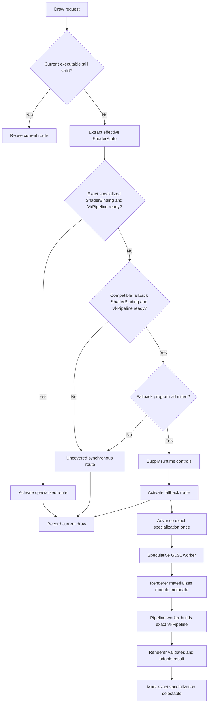

# Vulkan Ubershader & Hybrid Specialization

The Vulkan ubershader path is an experimental latency-hiding architecture for first-use fragment-combiner work. Its purpose is narrow: a guest draw whose exact specialized fragment path has never been prepared should be able to use a compatible, already executable fallback while the optimized path is built elsewhere.

This page documents both the reusable architecture and the current xemu implementation boundary. The active implementation is [PR #71](https://github.com/Mainkill1/xemu/pull/71).

> **Documented source:** PR #71 head `8a280999ed782af6ffe26158aff9718ac3426d94`, with product-code change at `f3716a5a5cc5da14d12d644582f7755b12f87ef5`.
>
> **Status:** Draft / HOLD. Complete-pipeline routing and the background graphics-pipeline worker are implemented, but this exact head has not completed gameplay, full-XISO, Vulkan-validation, or retail-performance qualification. Earlier >80 ms cold frames remain unattributed.

For a project-independent implementation sequence, see [[Hybrid Shader Research Guide|Hybrid-Shader-Research-Guide]]. For the normal shader and pipeline layers, see [[Vulkan Shader Binding & Compilation|Vulkan-Shader-Binding-and-Compilation]].

## The problem being solved

A first-seen guest shader state can place several host-side operations directly in front of a draw:

```text
guest draw
    ↓
extract guest shader state
    ↓
generate specialized GLSL
    ↓
glslang → SPIR-V
    ↓
create VkShaderModule and reflection metadata
    ↓
construct pipeline layout and fixed-function recipe
    ↓
vkCreateGraphicsPipelines
    ↓
record draw
```

PR #68 measured genuinely first-seen shader sources in a reproduced PGR2 hitch. A same-process cache cannot remove work for a source that has never existed, and a persistent SPIR-V cache only helps when the exact artifact was created in an earlier run.

The hybrid architecture changes the dependency for an admitted state:

```text
complete specialized executable ready?
    ├─ yes → draw specialized
    │
    └─ no
        ↓
complete compatible fallback executable ready?
    ├─ yes → draw fallback now
    │          +
    │        prepare exact specialization asynchronously
    │
    └─ no → explicit uncovered path
             may synchronously construct one route
```

The fallback does not replace specialized shaders. It is temporary execution coverage while specialization catches up.

## The artifact ladder

Researchers must keep the following objects separate:

```text
guest shader state
    ↓
generated source
    ↓
SPIR-V artifact
    ↓
VkShaderModule + reflection metadata
    ↓
ShaderBinding
    ↓
VkPipelineLayout + compatible render pass
    ↓
VkPipeline
    ↓
complete executable draw route
```

Readiness at one level does not imply readiness at the next:

```text
SPIR-V ready
    != shader module ready
    != shader binding ready
    != graphics pipeline ready
    != executable route ready
```

This distinction is central to the current PR #71 design. An earlier module-first design is superseded. Publishing a specialized module alone does not advance route selection. Promotion occurs only after the renderer adopts the matching complete specialized graphics pipeline.

## Current end-to-end flow



The current product code already enforces the most important complete-readiness rule:

```text
specialized route usable
    only when
specialized ShaderBinding ready
    AND
matching specialized VkPipeline ready
```

A complete fallback similarly requires its shader-binding metadata and graphics pipeline. Per-draw control support and temporary resource availability are separate questions and should not be confused with pipeline existence.

## Identities that must remain separate

A hybrid renderer usually needs at least three identities.

### Desired specialization identity

The complete guest request whose optimized path should eventually execute. It includes every guest state field that changes generated shader behavior and every fixed-function/attachment/vertex-input field required by the exact host graphics pipeline.

### Fallback-family identity

The state that remains compile-time-specialized in the fallback. PR #71 interprets the fragment-combiner words at runtime but retains the generated fragment shell, texture-stage behavior, interpolation, clipping, output/depth behavior, vertex and geometry interfaces, attachment formats, vertex input, and fixed Vulkan pipeline state.

The fallback key therefore canonicalizes only state that genuinely moved into runtime data.

### Executable-pipeline identity

The exact host graphics-pipeline recipe:

```text
shader stages
+ pipeline layout
+ render pass / attachment contract
+ vertex input
+ input assembly
+ raster state
+ multisample state
+ depth/stencil state
+ blend state
+ required dynamic-state declaration
```

A fragment module may participate in many executable pipelines. This is why fragment-module completion cannot be treated as route completion.

## Important source files

| File | Responsibility |
| --- | --- |
| `hw/xbox/nv2a/pgraph/vk/draw.c` | Complete route probing, `PipelineKey` construction, pipeline recipes, synchronous uncovered path, pipeline-worker submission and adoption |
| `hw/xbox/nv2a/pgraph/vk/shaders.c` | Shader-state extraction, shader/module caches, fallback controls, speculative compilation, descriptor/uniform updates |
| `hw/xbox/nv2a/pgraph/vk/hybrid-ready.h` | Side-effect-free ready probes and complete-candidate route selection |
| `hw/xbox/nv2a/pgraph/vk/hybrid-policy.c/.h` | Shader-work retry, backoff and decision metadata |
| `hw/xbox/nv2a/pgraph/vk/hybrid-compiler.c/.h` | Independent speculative and draw-required compiler lanes |
| `hw/xbox/nv2a/pgraph/vk/hybrid-pipeline-builder.c/.h` | Bounded graphics-pipeline worker and deep-owned Vulkan recipe copy |
| `hw/xbox/nv2a/pgraph/vk/hybrid-trace.c/.h` | Opt-in slow-frame attribution ring |
| `hw/xbox/nv2a/pgraph/vk/ubershader-controls.c/.h` | Stable 448-byte control ABI and fail-closed admission |
| `hw/xbox/nv2a/pgraph/glsl/psh-uber.c/.h` | Runtime fragment-combiner evaluator emitted as GLSL |
| `hw/xbox/nv2a/pgraph/vk/ubershader-combiner-oracle.c/.h` | CPU semantic oracle for supported combiner behavior |
| `hw/xbox/nv2a/pgraph/vk/renderer.c/.h` | Renderer lifetime, worker ownership and pending-result integration |
| `include/qemu/lru.h` | Exact non-creating lookup and explicit recency touch |
| `ui/xemu-tweaks.c/.h`, `ui/xui/main-menu.cc` | Default-off, restart-latched advanced toggle |

## Specialized shader versus runtime fallback

The specialized path turns guest state into program structure:

```text
guest combiner state
    ↓
GLSL generator
    ↓
combiner choices become generated code
    ↓
glslang
    ↓
specialized SPIR-V
```

The fallback moves admitted combiner state into runtime data:

```text
guest combiner state
    ↓
validated control packet
    ↓
precompiled fragment evaluator
    ↓
runtime register / branch / arithmetic behavior
```

| Path | First-use CPU behavior | GPU behavior | Correctness boundary |
| --- | --- | --- | --- |
| Specialized | May require source generation, compilation and pipeline creation | Narrow state-specific shader | Existing generator and renderer |
| Fallback | Reuses an already executable family | More runtime branching and register work | Only explicitly admitted programs |

The fallback is intended to improve interruption and tail latency. It is not assumed to improve average GPU throughput.

## The 448-byte control ABI

The renderer does not upload raw `PshState`. It uses an explicit, aligned `PGRAPHUberControls` packet.

```text
bytes 0..15     header[4]
                ABI version
                active stage count
                raw combiner control
                reserved zero

bytes 16..143   8 stages × 4 uint32 values
                RGB inputs
                alpha inputs
                RGB outputs
                alpha outputs

bytes 144..159  final_words[4]

bytes 160..447  18 × vec4 float constants

Total           448 bytes
Alignment       16 bytes
```

Static assertions pin the offsets and total size. A defined ABI avoids host padding, `bool` representation, enum width and compiler-layout dependencies.

### Static program versus dynamic values

The current packet combines two classes of data:

```text
program/control identity    bytes 0..159
combiner constants          bytes 160..447
```

For a mature implementation, validate and cache the static program portion when its guest program changes, then update constants only when their source epoch changes. Revalidating and comparing all 448 bytes on every fallback draw is avoidable steady-state work.

## Admission is fail-closed

`pgraph_vk_pack_ubershader_controls()` validates the runtime program before fallback execution is allowed. Current rejection classes include:

- null or invalid packet/source;
- unsupported stage count;
- unsupported combiner-control bits;
- unsupported LSB mux behavior;
- invalid RGB or alpha input encoding;
- invalid RGB or alpha output encoding;
- unsupported final-combiner state, flags or inputs.

The rule is:

```text
runtime evaluator proves support
    → fallback program admitted

support is absent or uncertain
    → use established specialized path
```

This is the fidelity boundary. Coverage must not be increased merely by skipping a validation whose semantics are not proven.

## Complete route readiness

A complete specialized candidate requires:

```text
exact specialized ShaderBinding
+ exact specialized VkPipeline
```

A complete fallback candidate requires:

```text
compatible fallback ShaderBinding
+ compatible fallback VkPipeline
+ admitted runtime program
```

Temporary descriptor or staging pressure should be classified separately:

```text
READY
    draw can proceed immediately

NEEDS_ROLLOVER
    same fallback remains correct after existing resource reset/finish path

UNAVAILABLE
    route is semantically or structurally incompatible
```

A temporary rollover is not a reason to abandon a correct fallback and synchronously construct specialization.

## Side-effect-free probing

A readiness query must not create, evict, compile, allocate or change recency. PR #71 adds `lru_find_existing()` for exact-key, non-creating lookup.

```c
LruNode *node = lru_find_existing(cache, hash, key);
if (!node) {
    return NULL;
}
```

Only the selected executable should subsequently receive an LRU recency touch.

A function named “lookup” is not necessarily a probe. In xemu, `lru_try_lookup()` can allocate or evict and invoke an initialization callback. It must not be used to answer “is this already executable?”

## Worker model and ownership

PR #71 currently has three worker roles.

```text
speculative compiler lane
    prepares future specialized SPIR-V

required compiler lane
    services draw-required GLSL without waiting behind speculation

pipeline worker
    executes vkCreateGraphicsPipelines from an owned recipe
```

### Why required and speculative compilation are separate

A single non-preemptible compiler worker can produce head-of-line blocking:

```text
speculative job already compiling
    ↓
draw discovers required shader
    ↓
required request waits for speculative compile
```

Commit `601361bf` introduced an independent required lane. A focused red/green test failed against the old worker and passed with the repair.

### Pipeline recipe ownership

A copied `VkGraphicsPipelineCreateInfo` is not a deep copy. It points to stage arrays, vertex descriptions, attachment arrays, dynamic-state arrays, optional structures and names.

The pipeline worker therefore deep-copies the supported recipe graph before the submitting stack frame returns. It rejects unsupported `pNext` chains and specialization structures rather than retaining unowned pointers.

The renderer retains referenced shader modules, pipeline layout and render pass while the job is in flight. The worker never mutates renderer LRUs or current bindings.

### Current ownership boundary

**Worker-owned or worker-safe**

- deep-owned GLSL and compiler configuration;
- SPIR-V output;
- deep-owned graphics-pipeline create-info graph;
- `vkCreateGraphicsPipelines()` for the submitted recipe;
- result timestamps and result identity.

**Renderer-owned**

- guest state extraction;
- route selection;
- `VkShaderModule` materialization/reflection;
- current pipeline-layout creation and render-pass lookup;
- LRU mutation and cache publication;
- descriptor and uniform updates;
- command recording;
- route transition and teardown.

The statement “all Vulkan object creation remains on the renderer thread” is no longer correct for the documented head. Graphics-pipeline creation runs on the pipeline worker; cache installation remains renderer-owned.

## Promotion state machine

A fallback should schedule each missing artifact once, then cheaply observe its state.

```text
ABSENT
    ↓ submit shader source once
SHADER_PENDING
    ↓ module adopted
SHADER_READY
    ↓ submit exact pipeline once
PIPELINE_PENDING
    ↓ pipeline adopted
READY
```

Failure states should remain visible:

```text
QUEUE_BACKOFF
FAILED_BACKOFF
FAILED_PERMANENT
```

A stable fallback draw should not rediscover and resubmit the same work every draw. Retry timing should be based on guest frames or monotonic time, not draw count, because one game can issue thousands of draws in a frame.

## Hot-path operation order

The common successful route must return before work associated with another route begins.

### Preferred order

```text
1. Current executable still valid?
       → update only dirty per-draw data and return

2. Complete specialized executable ready?
       → activate and return

3. Complete compatible fallback ready?
       → prepare only required fallback data
       → activate fallback
       → advance promotion once if due
       → return

4. Neither route executable
       → enter comprehensive uncovered path
```

### Avoid this order

```text
build specialized candidate
build fallback candidate
pack fallback controls
preflight fallback resources
scan work tables
poll worker queue
then choose a route
```

This distinction is not stylistic. Cache keys, packet validation, queue locks and work-table scans can turn a rare miss feature into steady-state overhead.

## Desired fast paths

### Stable specialized draw

```text
state generations unchanged
+ current specialized pipeline still valid
    → no fallback probe
    → no control packet work
    → no worker lock
    → no pipeline-key rebuild
```

### Stable fallback draw

```text
state generations unchanged
+ current fallback pipeline still valid
+ promotion not newly ready
    → update controls/constants only if dirty
    → retry promotion only when due
    → no full route reprobe
    → no duplicate submission
```

### Result publication

```text
result_available atomic flag false
    → no queue mutex

result_available true
    → take bounded results
    → validate generation + ticket + exact key
    → install or discard
```

## Descriptor layout and control upload

When the restart-latched feature is enabled, the descriptor layout adds one dynamic uniform-buffer binding for `PGRAPHUberControls`.

```text
baseline
    vertex UBO
    fragment UBO
    texture descriptors

hybrid enabled
    baseline bindings
    + dynamic fallback-control UBO
```

A control-only update can append a new control packet and bind a new dynamic offset while reusing the preceding descriptor set. The code ordering must allow that reuse before asserting that a new descriptor slot exists.

## Cache publication capacity

Submitting a pipeline job should reserve a future publication slot or otherwise guarantee safe adoption. Merely checking that `pipeline_cache.num_free > 0` is not a reservation:

```text
one free slot
    job A sees one free → accepted
    job B sees one free → accepted
    job C sees one free → accepted
```

Only one result may later fit. The other successful driver-created pipelines can be discarded.

A robust implementation either:

- reserves an actual LRU node;
- reserves counted publication capacity;
- or retains completed results until a safely evictable node becomes available.

A hard-full cache can still contain safely evictable entries. `num_free == 0` must not automatically mean no nonblocking publication route exists.

## Current limitations at the documented head

The following are source-level findings in `8a280999`/`f3716a5a`. They are not all proven owners of the historical 81–85 ms events.

### Confirmed source behavior

| Finding | Consequence |
| --- | --- |
| Fallback resource readiness is Boolean and conservative | Temporary descriptor/staging pressure can classify a complete fallback as unavailable and redirect to synchronous specialization |
| Control-only descriptor reuse occurs after a free-slot assertion | Assertions-enabled builds can reject a path that intended to reuse the preceding descriptor set |
| Pipeline jobs do not reserve publication capacity | Multiple expensive jobs can compete for the same future cache slot; completed pipelines may be destroyed unadopted |
| Pipeline failure state is cleared after completion | Persistent failures can be requested repeatedly without bounded pipeline-level backoff |
| Retry epochs advance per route-selection invocation | Draw-heavy games can exhaust backoff within one frame |
| Any adopted pipeline advances a global selection epoch | Unrelated completion can force unnecessary state extraction/reselection |

### Performance hypotheses requiring exact-head measurement

- fallback draws lack a complete reuse fast path;
- specialized and fallback candidate keys can both be constructed before short-circuiting;
- the pipeline-result queue can be polled under a mutex on ordinary draws;
- the 448-byte packet can be validated and compared repeatedly;
- `vkCreatePipelineLayout()` remains on the renderer thread during promotion preparation;
- render-pass lookup or creation remains on the renderer thread;
- the production recipe is assembled, then generically validated/copied again by the worker boundary;
- shader and pipeline result limits are per invocation/draw rather than one shared frame budget.

These must be reported as hypotheses until a trace attributes time to them.

## Slow-frame attribution

Set `XEMU_VK_HYBRID_TRACE` to a file path to enable the opt-in diagnostic ring. The trace records detailed events only for frames meeting the configured slow-frame threshold.

Current event classes include:

- required and speculative compile timing;
- shader completion adoption and batch timing;
- shader-binding and complete-pipeline probes;
- renderer-thread graphics-pipeline creation;
- route transitions;
- renderer finish and fence wait;
- descriptor, buffer, framebuffer and pipeline-cache shortages;
- uncovered route decisions;
- background pipeline submit and adoption;
- warm SPIR-V module materialization;
- pipeline-layout creation;
- render-pass lookup or creation.

The trace is diagnostic. Acceptance timing must use a normal build with tracing disabled because serialization and file output can perturb following intervals.

## Evidence labels

Use explicit evidence strength when documenting findings:

| Label | Meaning |
| --- | --- |
| Confirmed source behavior | A deterministic path or invariant is present in inspected code |
| Focused test result | A unit/integration test proves one isolated behavior |
| Observed in trace | Runtime events/timing were captured on a named exact head |
| Performance hypothesis | Plausible cost path not yet attributed in runtime evidence |
| Qualified result | Repeated normal-run result passed correctness and performance gates |
| Historical result | Result belongs to an older source and does not qualify current head |

Do not turn a source suspicion into a claimed stall owner.

## Qualification requirements

A useful comparison includes at least:

```text
previous main
candidate Hybrid Off
candidate Hybrid On
```

Control these cache layers separately:

- same-process shader/module cache;
- persistent SPIR-V cache;
- application `VkPipelineCache` state;
- driver-managed cache state.

Report:

- p50, p95, p99, p99.9 and maximum guest-frame interval;
- stall counts at defined thresholds such as 50, 75 and 100 ms;
- guest-frame and guest-work totals;
- complete specialized, complete fallback and uncovered draw counts;
- foreground versus worker pipeline-creation count and maximum duration;
- shader and pipeline submission/deduplication counts;
- discarded or deferred pipeline results;
- required/speculative/pipeline-worker overlap;
- renderer-thread module, layout and render-pass timing;
- resource rollover and fence-wait reasons;
- functional hashes and Vulkan validation errors.

A lower frame tail is not valid evidence if less guest work completed.

## What another emulator should reuse

Portable design ideas:

- distinguish module readiness from complete pipeline readiness;
- keep desired guest state, fallback family and exact pipeline identities separate;
- use side-effect-free probes;
- retain specialized-first fast ordering;
- isolate required work from speculative work;
- deep-own all cross-thread data;
- adopt complete artifacts under the renderer’s cache lock/ownership model;
- represent queue pressure and failure as persistent states;
- classify resource rollover separately from route incompatibility;
- qualify tail latency and guest work, not average FPS alone.

Do not copy blindly:

- NV2A combiner encodings;
- xemu’s descriptor layout;
- the 448-byte packet shape;
- current queue sizes;
- fallback-family canonicalization fields;
- current uncovered-route policy;
- another emulator’s shader arithmetic.

The reusable architecture is the state machine and ownership model, not the guest-specific evaluator.

## Related development

### PR #68 — shader-module miss classification

[PR #68](https://github.com/Mainkill1/xemu/pull/68) established that the primary reproduced PGR2 hitch contained genuinely first-seen shader sources. It also demonstrated why binding misses, stage-module misses, compiler calls and pipeline creation must be timed separately.

### PR #70 — persistent SPIR-V reuse

PR #70 covers exact shader artifacts already encountered in an earlier run. It cannot by itself hide a never-before-seen specialization.

### PR #71 — optional Vulkan ubershader

Current implemented pieces include:

- 448-byte stable control packet and fail-closed admission;
- runtime fragment-combiner evaluator and CPU oracle;
- exact side-effect-free shader/pipeline probes;
- complete-pipeline route selection;
- separate speculative and draw-required GLSL workers;
- bounded deep-owned graphics-pipeline worker;
- module completion that does not promote by itself;
- renderer-side exact-key adoption and selection epoch;
- opt-in slow-frame attribution.

Current status remains **Draft / HOLD** until exact-head functional and normal-run gates pass.

## See also

- [[Hybrid Shader Research Guide|Hybrid-Shader-Research-Guide]]
- [[Vulkan Shader Binding & Compilation|Vulkan-Shader-Binding-and-Compilation]]
- [[Vulkan Performance|Vulkan-Performance]]
- [[Performance Methodology|Performance-Methodology]]
