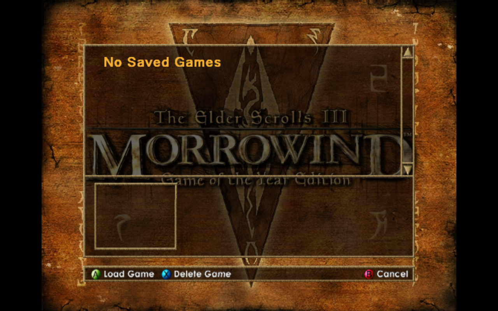
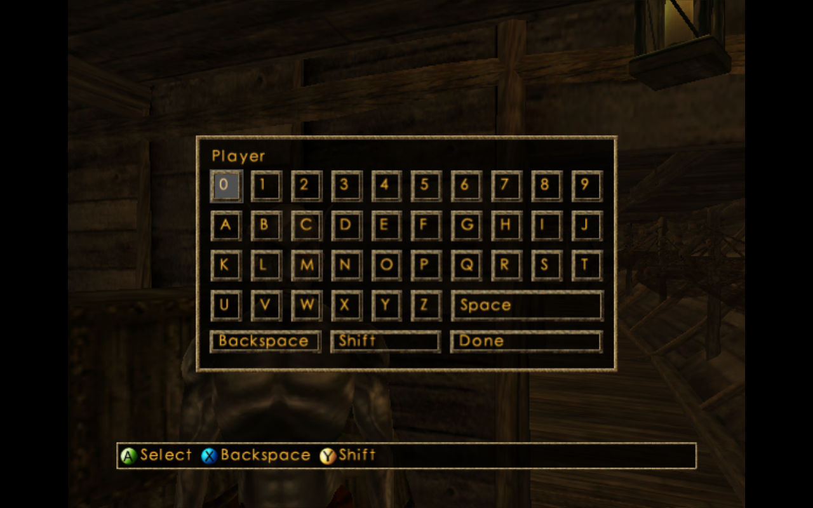

# Issue #246: Morrowind scene qualification follow-up

**HOLD.** Both follow-ups ran on Steam Deck **10.0.0.123** through the maintained
HTTP runner. New Game reaches a rendered initial 3D ship interior behind the
name-entry dialog. Load reaches **No Saved Games**. Neither procedure measures
repeatable texture eviction/recreation or an optimization's performance.

The [first three attempts and reader tests](../issue246-allocation-preflight-20261002/README.md)
remain intact. These two additional attempts have separate immutable saved
recipes, complete original evidence and explicit visual scene audits.

This is a historical parent-only packet. The later
[collector validation](../issue246-allocation-trace-local-20261002/README.md)
adds optional runtime measurement; no collector candidate was used here.

## Before/candidate distinction

**A:** exact main `ee5ce48b48784f999af374c1452003f8b2b1230f`, the same executable
as the first packet. **B:** not implemented. Physical follow-up order: Load v3,
then New Game v4. These are different procedures on A, with existing logging
and three 30-second CPU profiles each. They are not A/B repetitions, ABBA/BAAB
blocks or normal release measurements. **Improvement %: not measured.**

| Main A attempt | First-to-last log timestamp span (s) | Consecutive log frame records | Binding host elapsed total (s) | Upload host elapsed total (s) | Maximum accumulated binding work in one log frame (ms) | Actual scene |
|---|---:|---:|---:|---:|---:|---|
| Morrowind Load v3 | 168.841 | 9,670 | 5.732 | 4.491 | 4.340 | No Saved Games; menu only |
| Morrowind New Game v4 | 234.498 | 7,693 | 4.935 | 2.167 | 8.750 | Initial ship interior and NPC behind name-entry dialog |
| Candidate B | — | — | — | — | — | Not implemented |

Upload is inside binding. **Do not add columns or score these rows as variants.**
These totals cover different full logs and work, not fixed-work CPU time,
single allocation latency, FPS or frame-time tails. Image create/destroy counts
and compatible reuse opportunities remain unmeasured.

## Why the runner's green checks need a scene audit

V3 explicitly chooses the observed Load menu item. Seven reviewed screenshots
show title/menu, then **No Saved Games** throughout its later profiles. The
5% nonblack-pixel contract at RGB threshold 96 passes on that dialog. The
original runner assessment stays completed/passed/complete/eligible for its
diagnostic contract; this does not qualify a world or streaming workload.

V4 chooses the observed New item, records loading for 30 seconds, then waits
90 seconds without input before its final 30-second profile. Six reviewed
screenshots show the menu, loading, text intro, and finally the initial rendered
ship interior/NPC behind the Player name-entry dialog at both profile boundaries.
The original visibility thresholds and image region remain unchanged. Its
runner diagnostic contract passes. This qualifies a stationary initial 3D
diagnostic, with a modal UI, rather than open-world streaming or transitions.

The JSON scene audits hash every original screenshot and record these limits.
All thirteen captures, including startup/loading/intro, are in the archives.

## CPU attribution and the next measurement

All six recordings match ELF Build ID
`7cc47cc0deb81956e198d71935d1a198116cdb02` and the original debug/library bundle.
Full leaf exports, unfiltered inclusive reports, commands and summaries are
retained. Their 30-second windows use wall-clock phases, not guest work markers.

| Attempt / phase | Process userspace cycle samples | Named image-create/destroy leaf samples |
|---|---:|---|
| Load v3 / startup | 7,984 | None |
| Load v3 / load observation | 6,644 | None |
| Load v3 / scene observation, still menu | 6,614 | None |
| New Game v4 / startup | 7,943 | None |
| New Game v4 / loading/text intro | 6,765 | None |
| New Game v4 / initial interior with modal UI | 7,501 | None |

In the final interior profile, texture dirty marking accounts for 0.858% and
binding for 0.132% of sampled process cycle period. Inlined `create_texture`
has 1.45% inclusive attribution; it includes cache lookup, hashing and upload,
so it is not `vmaCreateImage` cost. Named VMA map/flush helpers occur, but do
not establish allocation creation or destruction. Missing leaf samples do not
prove zero cost: inlining, library execution and unwind limitations matter.

At log frame 5,922 in v4, `pipeline_prepare` accumulated 666.400 ms,
`bind_textures` 8.750 ms and `texture_upload` 4.858 ms of host elapsed work.
These are nested diagnostic region measurements, not additive frame times or
an allocation cost estimate. Existing telemetry cannot isolate allocation calls.
The next allocation decision needs rare lifecycle attribution and controlled
observer-cost checks before any pool or performance claim.

## Exact inputs, cache and remaining risks

The [original packet](../issue246-allocation-preflight-20261002/README.md#exact-inputs-and-cache-controls)
documents source/build/catalog identities. Both follow-ups retain exact
manifests: executable SHA-256
`4a6e0dae0a83a870aebde726ca40687f35c9293f3da1147a6d7d14e8c4e8e01a`, Vulkan,
x11, full DSP/JIT, VP workers 0, 128 MiB guest, scale 1 and vsync off;
runner `0.2.0+848dca74e1ff79f9fc886769a785c23a0945a87e`.
The private HDD is a full copy of the pinned Morrowind carrier. No old VM state
is restored. Original disc/HDD/firmware assets remain intact and are not published.

Both private Mesa inventories were empty before launch, with complete private
writes afterward: v3 283 files / 2,883,305 bytes; v4 394 files / 3,053,014 bytes.
Both report `mesa_private_disk_writes_observed`, `verified: true`, no issues,
no waiver and cache `comparisonReady: true`. OS page cache and driver memory
cache remain uncontrolled. This is not complete machine-cold qualification.
Both exit 0 with the original nonfatal GLib shutdown assertion retained.

The current source defines quarter-cache trimming, but its VMA budget-query
and pressure-triggered invocation in `pgraph_vk_check_memory_budget()` are
inside `#if 0`. A future pool cannot assume an active production pressure drain.
Its pressure policy, allocation identity, fence/lifetime safety and retained
memory still need implementation and tests if material reuse is established.

## Durable evidence and reuse

| Saved HTTP test/job | Immutable recipe revision | Run ID |
|---|---|---|
| `issue246-deck-parent-morrowind-load-preflight-v3` | `ef0b59de087e459a9fe8359c2557655000cbca55e443ec422d75bce2a6fce268` | `20261002-040828144-e0b808cb4bce45eebe8f54fd03119e26` |
| `issue246-deck-parent-morrowind-newgame-preflight-v4` | `510906726a4677349f4159a53d299e85724fe63dbbfb23a0f610649d30a1cb01` | `20261002-042443919-847c361855fd4746a5ba25d5508e966e` |

These procedures remain saved for maintained HTTP-client selection with an
explicit application and fresh attempt ID. Preparation and symbol-resolution
scripts are retained in each packet. They are diagnostics with the scene
limits above, not general correctness references or completed acceptance tests.

- [Load v3 archive](morrowind-v3-records.tar.gz) and [hashed inventory](morrowind-v3-manifest.json.gz).
- [New Game v4 archive](morrowind-v4-records.tar.gz) and [hashed inventory](morrowind-v4-manifest.json.gz).
- [Verification](verification.json): every payload reread and rehashed; six original
  perf recordings, both original diagnostic ZIPs and full telemetry retained.

Raw cache payloads remain local/server-side with hashes in the inventories;
local symbol-resolution symlinks are omitted. No original outcome is modified.
No emulator runtime change, texture pool, XISO runtime comparison or performance
gain is present on this branch. The reusable offline reader still has eleven
passing checks. #246 remains open, and PR #293 remains draft/HOLD.
