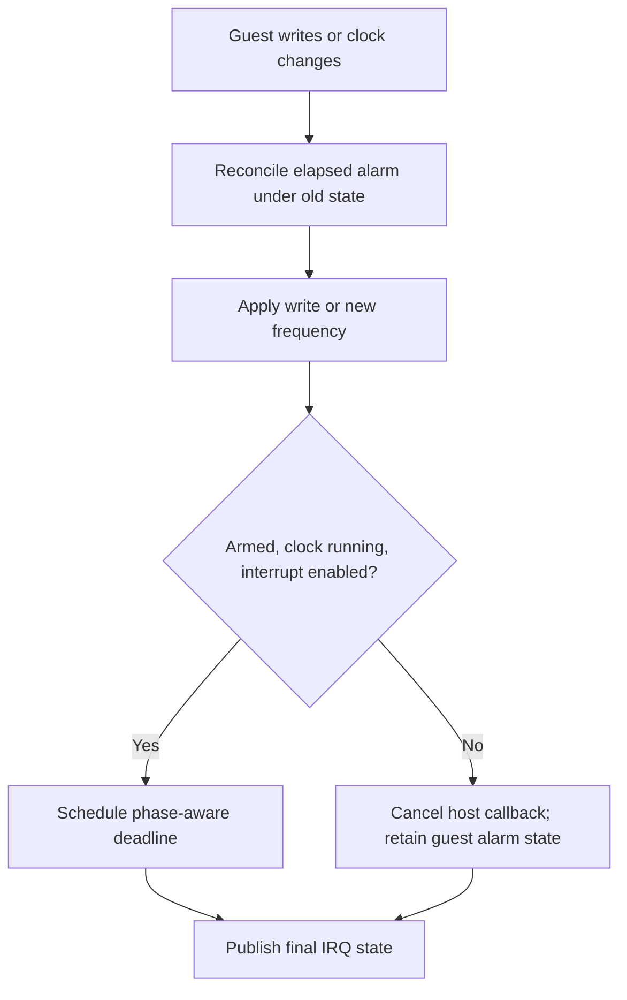

# Masked PTIMER alarms and clock transitions

Tested implementation: `a48b8304db16bbf5eaa48e7d13bd4e3c734e40d7`. Parent: `f4edc971fd3bc5dce645c8f06ce76ff17dd2db17`.

The guest alarm now has explicit `alarm_armed` state. Programming the comparator
arms it; reset disarms it. A masked or stopped clock has no scheduled QEMU timer,
but polling, acknowledgment, unmasking and register changes still reconcile the
guest alarm. Elapsed epochs advance mathematically to the next comparator match.
The existing forward-clock calculation and offset semantics remain unchanged.

The PRAMDAC NVPLL register path now reconciles the old rate before replacing the
frequency and rebuilding the deadline. Source-clock zero cancels scheduling;
restart reschedules an armed enabled alarm. This preserves the existing
absolute-time-based clock model rather than introducing continuous phase across
rate changes.

## Snapshot contract

NV2A stream version 5 adds the armed bit. Version 4 derives it from its serialized
host timer, which represented armed state even when masked or stopped. Pre-load
clears alarm/time-offset/timer state before reading a stream, so versions 1–3,
which contain no such fields, do not inherit the previous guest's timer. Pending
and enabled interrupt registers still come from the stream. No existing snapshot
is modified. Older binaries are not promised to load version-5 snapshots.

**Real VMState stream and native snapshot qualification remain pending.** Unit
coverage invokes production post-load/version handling and reset directly. It
does not serialize a complete NV2A stream or execute the enclosing pre-load hook.
Independent source review found no blocker but specifically requested this
coverage before acceptance.

## Deterministic results

| Control | Before | After |
| --- | --- | --- |
| Program masked comparator | Host timer remains queued | No queued timer; guest alarm remains armed |
| Poll after multiple masked epochs, then unmask | Host timer remains queued during polling | Pending alarm observed; IRQ delivered; next deadline future |
| PLL register changes 1 GHz to 99,999,996 Hz | Old 8 ns deadline retained | Correct 81 ns deadline |
| PLL slows again, stops after expiry, restarts | No PLL-to-PTIMER reschedule hook | 161 ns deadline; old-rate pending preserved; stop cancels; restart schedules |
| Restore v4/v5 masked alarm state | Implicit host-timer dependency | Guest armed state survives canceled callback |

The first and third rows have executed old-code negative controls: the same
masked scheduling control fails on parent production source, and the direct
PRAMDAC register control fails with the parent PRAMDAC implementation while
holding the current PTIMER implementation fixed (8 instead of 81 ns).

Both compiler-128 and software-wide builds pass **23/23 tests**, each including
**34,560 independent forward-clock cases**. The unit now compiles actual PTIMER
and PRAMDAC translation units. The existing generic `ptimer-test` passes
**576/576**, checking the shared fixture after its `timer_del()` was corrected
to clear expiry/link state like production timer deletion.

The changed `nv2a.c`, `ptimer.c` and `pramdac.c` also pass Windows-target syntax
checks with real NV2A headers and generated build configuration. This checks
migration declarations and call signatures, not linkage or serialized streams.
The Meson unit target now includes `pramdac.c`; a full Meson/app rebuild remains
pending. Tests ran under Wine, not native Windows.

## Reproduction and remaining qualification

Use the existing `test-xbox-nv2a-ptimer` unit target. New controls include
`masked-no-callback`, `rate-changes-masked`, `restore-versions`, and `pll-register`
under `/xbox/nv2a/ptimer/`. The previous acknowledgment/stopped-clock controls
remain. [The manifest](masked-manifest.json) records exact source and binary
identities; the pinned toolchain and generated-config identity are unchanged
from [the initial manifest](manifest.json).

Keep #40 open and PR #48 draft until real stream compatibility and remaining
emulator qualification are established. No retail or XISO campaign was repeated.
Zero queued masked callbacks proves eliminated scheduling in the controlled
state; it is not an FPS, CPU, power or game-level performance measurement.
