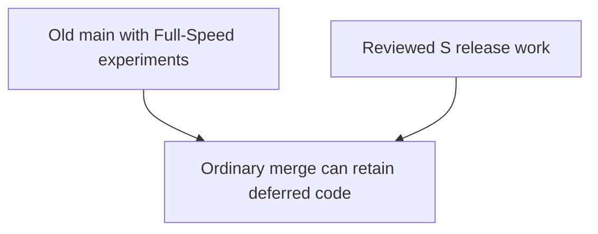
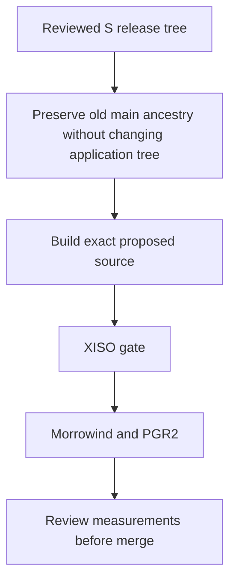

# S-based release integration — final-source qualification held

Status: **Held**. The automated correctness/retail campaign completed, but Morrowind cadence remains lower in the candidate. This report does not establish a speedup or a cause for that difference.

PR: [#51](https://github.com/Mainkill1/xemu/pull/51). Issue: [#38](https://github.com/Mainkill1/xemu/issues/38).

## Source and build

- Baseline: cumulative S `208e4596832a1f949bd63822d5ddd962c4575067`; tested tree-identical source `3caf5d85423298c62344f8fe44fe9a1176b8ae81`; executable SHA-256 `fe8047f60181672170524cf40b2151f335f0e232d749b569b60fd5bc2cb5d6ba`.
- Candidate: `dfe9aadf158af5e8808c109e5a48802377f23a7e`; tree `354f00baffb8e5bacbfb7a1ac024228c7709bd1e`; executable SHA-256 `bf50e1005f122c43b1a6845f72b3e39c0cd1ed912192e0a9cc992a95bfcc9116`.
- Windows optimized build: official build wrapper without `--debug`, pinned toolchain, optimization 2, full LTO, x86-64-v3. The literal Meson labels are `buildtype=debug`, `debug=true`, `b_ndebug=false`; these labels and optimization settings match the recorded baseline recipe.
- [Build and native-unit manifest](build-manifest.json). Original released S remains unchanged; this comparison uses cumulative S, not the earlier released-S binary.

## Goal and changes

Make the reviewed S-derived release tree the proposed main tree while preserving old main's ancestry. An ordinary merge could retain the deferred Full-Speed experiments. PR #51's ancestry merge changes no application source relative to its release parent. The current application includes the already-reviewed LRU exhaustion repair (#47) and paused-snapshot save repair (#50), in addition to the [previously documented S-to-candidate deltas](../stable-v2-integration/REPORT.md#build-and-source-differences).

Draft #37 (Advance options) and #48 (PTIMER changes) remain excluded. Optional CPU-saving waiting is off in this campaign. No new optimization was inserted to improve these results.

**Before:**

**After:**

## Performance summary

These are guest display-write cadence and interval measurements, not rendered-frame counts. Each PGR2 result averages two run-level values; p95/p99 are averages of run percentiles, not pooled percentiles. Morrowind has one baseline/candidate pair per renderer. Signed changes are observed directions, not statistical Improve/Regress classifications.

| Workload / metric | Renderer | Baseline | Candidate | Delta |
| --- | --- | --- | --- | --- |
| morrowind / display-write cadence | OPENGL | 38.629 FPS | 37.381 FPS | -3.23% |
| morrowind / p95 interval | OPENGL | 32.600 ms | 34.001 ms | +4.30% |
| morrowind / p99 interval | OPENGL | 36.615 ms | 39.965 ms | +9.15% |
| morrowind / display-write cadence | VULKAN | 27.685 FPS | 26.745 FPS | -3.39% |
| morrowind / p95 interval | VULKAN | 44.614 ms | 43.884 ms | -1.64% |
| morrowind / p99 interval | VULKAN | 47.996 ms | 50.301 ms | +4.80% |
| pgr2 / display-write cadence | OPENGL | 30.006 FPS | 30.005 FPS | -0.00% |
| pgr2 / p95 interval | OPENGL | 39.584 ms | 39.533 ms | -0.13% |
| pgr2 / p99 interval | OPENGL | 42.246 ms | 42.516 ms | +0.64% |
| pgr2 / display-write cadence | VULKAN | 30.008 FPS | 30.001 FPS | -0.02% |
| pgr2 / p95 interval | VULKAN | 39.495 ms | 39.981 ms | +1.23% |
| pgr2 / p99 interval | VULKAN | 41.818 ms | 42.838 ms | +2.44% |

Morrowind's Vulkan cadence flag repeated on this final source; OpenGL is also lower in this pair. Vulkan Morrowind p95 is lower, but p99 is higher. PGR2 cadence stays near 30 FPS; its Vulkan p99 rises rather than improving. Earlier unfavorable and favorable observations remain in the [historical report](../stable-v2-integration/REPORT.md) and are not replaced by this campaign. Small samples and the baseline-first Morrowind order do not establish causality or a non-inferiority bound.

[Full retail measurements, including PGR2 host-presentation FPS/p95/p99](retail-per-run.csv).

## Test results

- Exact-source native Windows units: 4 LRU, 10 polling, 7 Vulkan failure-state and 5 texture-state cases passed; all four programs returned zero without timeout.
- Snapshot lifecycle harness: 150 actual save/NV2A lifecycle attempts passed.
- XISO ran first: 152 records twice per renderer, 608/608 total; all functional-hash checks passed; zero Vulkan VUIDs.
- Morrowind: four cells, fixed immutable snapshot, five-second wait followed by Start/B, ten-second measurement. The wrapper's interval argument 0 means no override; sealed results record effective interval 1.
- PGR2: eight full-start cells, 60-second measurements, baseline–candidate–candidate–baseline per renderer, interval 1. This is the established stationary-car workload, not the separate lag-objective snapshot.
- Every retail cell sealed and deleted its private HDD. Controller cleanup recorded no remaining owned processes. All twelve end images were independently inspected: expected scenes, no pause/reconnect overlay or obvious visual corruption. End images alone do not prove every intermediate frame was correct.

### Test suite summary

XISO baseline timing was **not measured in this campaign**. The following candidate group sums are averages of the two runs' sums of per-test means/medians, in microseconds. They retain timing context but are not baseline-to-candidate performance proof. Do not substitute a historical different-suite baseline to manufacture deltas.

| Test group | Renderer | Tests/run | Baseline | Candidate mean sum us | Candidate median sum us | Delta | Correctness |
| --- | --- | --- | --- | --- | --- | --- | --- |
| busy_pfifo | opengl | 2 | Not run | 4780889.5 | 4780852.0 | N/A | 4/4 pass |
| busy_pfifo | vulkan | 2 | Not run | 5098989.0 | 5098611.5 | N/A | 4/4 pass |
| cpu_floating_point | opengl | 2 | Not run | 1274578.5 | 1273923.0 | N/A | 4/4 pass |
| cpu_floating_point | vulkan | 2 | Not run | 1273698.0 | 1272507.5 | N/A | 4/4 pass |
| cpu_translation_blocks | opengl | 3 | Not run | 543951.0 | 543977.0 | N/A | 6/6 pass |
| cpu_translation_blocks | vulkan | 3 | Not run | 536160.5 | 536163.0 | N/A | 6/6 pass |
| fill_rate | opengl | 2 | Not run | 2884.0 | 2531.5 | N/A | 4/4 pass |
| fill_rate | vulkan | 2 | Not run | 4666.0 | 3178.0 | N/A | 4/4 pass |
| game_load | opengl | 55 | Not run | 10635458.5 | 10642145.5 | N/A | 110/110 pass |
| game_load | vulkan | 55 | Not run | 7269464.0 | 7266241.0 | N/A | 110/110 pass |
| high_vertex_count | opengl | 4 | Not run | 210761.0 | 210496.5 | N/A | 8/8 pass |
| high_vertex_count | vulkan | 4 | Not run | 228964.5 | 228166.0 | N/A | 8/8 pass |
| pfifo_array_elements | opengl | 3 | Not run | 3739.5 | 3877.5 | N/A | 6/6 pass |
| pfifo_array_elements | vulkan | 3 | Not run | 2835.0 | 1935.0 | N/A | 6/6 pass |
| pipeline_texture_switch | opengl | 4 | Not run | 57070.0 | 57108.0 | N/A | 8/8 pass |
| pipeline_texture_switch | vulkan | 4 | Not run | 83668.5 | 83015.5 | N/A | 8/8 pass |
| primitive_type | opengl | 20 | Not run | 18787.5 | 17509.5 | N/A | 40/40 pass |
| primitive_type | vulkan | 20 | Not run | 17568.5 | 13499.0 | N/A | 40/40 pass |
| report_query | opengl | 8 | Not run | 6494.0 | 6201.0 | N/A | 16/16 pass |
| report_query | vulkan | 8 | Not run | 26676.0 | 25395.0 | N/A | 16/16 pass |
| surface | opengl | 28 | Not run | 346620.5 | 332178.0 | N/A | 56/56 pass |
| surface | vulkan | 28 | Not run | 1023291.0 | 980229.5 | N/A | 56/56 pass |
| texture_cubemap_fallback | opengl | 3 | Not run | 49130.0 | 50055.5 | N/A | 6/6 pass |
| texture_cubemap_fallback | vulkan | 3 | Not run | 46951.0 | 49645.0 | N/A | 6/6 pass |
| tiny_draw | opengl | 8 | Not run | 334309.5 | 333971.0 | N/A | 16/16 pass |
| tiny_draw | vulkan | 8 | Not run | 197901.0 | 197092.5 | N/A | 16/16 pass |
| uniform_thrash | opengl | 1 | Not run | 1623.0 | 1522.5 | N/A | 2/2 pass |
| uniform_thrash | vulkan | 1 | Not run | 2792.5 | 2080.5 | N/A | 2/2 pass |
| vertex_buffer_allocation | opengl | 9 | Not run | 837067.5 | 835099.0 | N/A | 18/18 pass |
| vertex_buffer_allocation | vulkan | 9 | Not run | 873617.0 | 876062.5 | N/A | 18/18 pass |

[All individual XISO measurements and hashes](xiso-per-test.csv) · [Group CSV](xiso-groups.csv). No per-test timing change is concealed by a claimed overall speedup; no such speedup is claimed.

## Resource impact

PGR2 only. Values are means of per-run means; sampled peaks below use the largest per-run peak. Each cell contains 20 process-resource samples and 10 device samples. Separate power/clock samples are restricted to the recorded measurement interval (10 samples per cell). These are sampled Windows/device accounting values, not allocation traces or guaranteed lifetime peaks. MiB conversions divide byte fields by 1,048,576 exactly once.

| PGR2 metric | Renderer | Baseline | Candidate | Delta |
| --- | --- | --- | --- | --- |
| Process dedicated GPU mean (MiB) | OPENGL | 210.405 | 158.481 | -24.68% |
| Process dedicated GPU sampled peak (MiB) | OPENGL | 210.660 | 159.105 | -24.47% |
| Process shared GPU mean (MiB) | OPENGL | 41.775 | 41.763 | -0.03% |
| Process shared GPU sampled peak (MiB) | OPENGL | 43.625 | 43.613 | -0.03% |
| Device-wide used VRAM mean (MiB) | OPENGL | 603.500 | 551.500 | -8.62% |
| Device-wide used VRAM sampled peak (MiB) | OPENGL | 604.000 | 552.000 | -8.61% |
| Process RAM working-set sampled peak (MiB) | OPENGL | 688.035 | 679.398 | -1.26% |
| Process private-memory sampled peak (MiB) | OPENGL | 2339.582 | 2280.617 | -2.52% |
| Host-capacity CPU mean (%) | OPENGL | 21.999 | 22.728 | +3.31% |
| Process GPU engine-sum mean (%) | OPENGL | 44.467 | 44.394 | -0.16% |
| Device GPU utilization mean (%) | OPENGL | 38.300 | 38.200 | -0.26% |
| Device power mean (W) | OPENGL | 24.102 | 24.093 | -0.04% |
| Graphics clock mean (MHz) | OPENGL | 684.750 | 681.000 | -0.55% |
| Memory clock mean (MHz) | OPENGL | 6001.000 | 6001.000 | +0.00% |
| Process dedicated GPU mean (MiB) | VULKAN | 674.942 | 670.611 | -0.64% |
| Process dedicated GPU sampled peak (MiB) | VULKAN | 675.852 | 670.898 | -0.73% |
| Process shared GPU mean (MiB) | VULKAN | 468.367 | 468.406 | +0.01% |
| Process shared GPU sampled peak (MiB) | VULKAN | 468.648 | 468.688 | +0.01% |
| Device-wide used VRAM mean (MiB) | VULKAN | 1043.500 | 1039.150 | -0.42% |
| Device-wide used VRAM sampled peak (MiB) | VULKAN | 1044.000 | 1040.000 | -0.38% |
| Process RAM working-set sampled peak (MiB) | VULKAN | 1121.695 | 1090.555 | -2.78% |
| Process private-memory sampled peak (MiB) | VULKAN | 3229.527 | 3191.086 | -1.19% |
| Host-capacity CPU mean (%) | VULKAN | 21.893 | 21.732 | -0.73% |
| Process GPU engine-sum mean (%) | VULKAN | 44.167 | 42.917 | -2.83% |
| Device GPU utilization mean (%) | VULKAN | 35.300 | 35.250 | -0.14% |
| Device power mean (W) | VULKAN | 21.434 | 21.243 | -0.89% |
| Graphics clock mean (MHz) | VULKAN | 440.250 | 415.500 | -5.62% |
| Memory clock mean (MHz) | VULKAN | 2107.750 | 1848.200 | -12.31% |

[Complete per-run resource values and sample counts](resources-per-run.csv).

OpenGL's lower dedicated GPU-memory reading repeated across both candidate runs, while shared memory remained similar and cadence stayed near 30 FPS. Vulkan's dedicated-memory difference is much smaller. Device-wide readings include usage outside xemu and must not be added to per-process dedicated memory. Shared GPU memory is separately accounted system memory, not extra dedicated VRAM. The larger OpenGL reduction is useful evidence; this combined comparison does not isolate which patch caused it.

Power is reported alongside cadence and clocks. Lower memory usage is not evidence of lower GPU work or lower power: OpenGL's sampled power remained similar. Small signed CPU/GPU/power differences are not independently classified as established gains or regressions.

## Decision and remaining work

**Hold integration.** Exact-source building, focused units, XISO correctness and the prescribed retail execution now have completed evidence. The Morrowind cadence flag remains unresolved; the promising OpenGL memory result does not clear it. No source PR is promoted to merge-ready solely by these aggregate results.

Next: use the actual S-to-candidate changes and retained evidence to isolate the Morrowind difference. Full-Speed behavior missing from both sides cannot alone explain that comparison. Any new optimization requires its own focused PR, exact-parent build, controls and matched testing. PR #37 and #48 retain their own qualification requirements.

## Evidence

[Manifest and output hashes](manifest.json) · [Build/native checks](build-manifest.json) · [Performance CSV](performance-summary.csv) · [Retail CSV](retail-per-run.csv) · [Resource CSV](resources-per-run.csv) · [XISO per-test CSV](xiso-per-test.csv) · [Reviewed end images](visual-review.md) · [Image hashes](visual-review.json).

The compact exports are derived from hash-verified sealed receipts. The complete private archive is retained with SHA-256 `fc92334dd59fe2951bc065c3baecf4d352dda4598ff053e3d6b334b4f8f746aa`; private host/configuration records are excluded from this public export. No build or test was rerun to recover publication output.

### Reproduce the Morrowind interval measurements

[Measured event times](morrowind-event-times.csv), [window/source manifest](morrowind-review-manifest.json), and [offline analyzer](analyze-morrowind.py) reproduce all four cadence/p95/p99 rows without running the emulator. Run `python3 analyze-morrowind.py .` in this directory. All 1,305 exported events are retained; no outlier removal is applied. None of these four ten-second windows contains an interval over 100 ms. The Vulkan median interval rises from 34.516 to 36.578 ms, so the cadence flag is not explained by one isolated long freeze. This observation does not identify the responsible patch.
