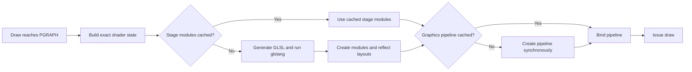
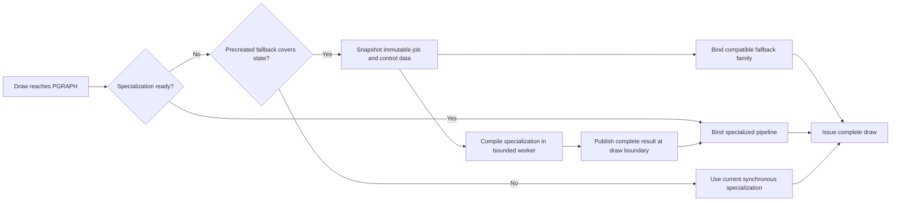

# research/vulkan-ubershader-design

**Status:** BLOCKED — design only; runtime work waits for PR #70 qualification and merge

**Stable baseline:** `9f618d6d8c4c446ef023955f3d4de22f661f61a4` / retained product executable `3489fdcc593e942b92a612bf35a98f509ff0907e3370e1e5f45f2972d83fb16b`

**Previous main:** `e18ba8d6274cf227cc9e5ae1b5684f28ed911a99`

**Current candidate:** Design-only PR head; no executable exists

**Direct-fix lane:** [PR #70](https://github.com/Mainkill1/xemu/pull/70)

**Cause diagnostic:** [PR #68](https://github.com/Mainkill1/xemu/pull/68)

**Exact trace build:** `1ba2c59ee69c6c909bd48b63290fa753ff5fe868` / executable `bf4a3908bcba4d3f6f891ad3562ff1f45a2042feca6c0a244072f1b0a7df4663`

**PR #68 parent:** `f738796284d374f1cf22b05a6f5f643268fc8ab0`

## Blocking dependency

**PR #71 must not start runtime ubershader implementation in parallel with PR
#70.** First qualify and merge PR #70's warm shader-management solution into
`main`. Any later ubershader implementation must branch from that post-#70
`main` and reuse or extend PR #70's artifact identity, bounded storage,
renderer ownership, failure fallback, and producer-quiesced persistence
lifecycle. This branch remains design documentation until that gate is met.

## Summary

**Current result:** Blocked on PR #70 qualification and merge. The design audit
supports a bounded hybrid ubershader family as a possible later cold-cache
fallback. It does not support treating one monolithic shader as a complete
replacement for xemu's current generated shader and graphics-pipeline path.

**Headline:** A precompiled interpreter can render a previously unseen NV2A
state while its specialized shader and pipeline compile in the background, but
the fallback must respect compile-time geometry interfaces, sampler types,
vertex input, attachment formats, and host Vulkan capabilities.

**Next:** Complete, qualify, and merge PR #70's direct warm-run SPIR-V reuse.
No runtime ubershader branch may start before that merge. The future
oracle/interpreter branch starts from post-#70 `main`, integrates its warm
artifact lifecycle, determines the smallest correct fallback family, and does
not enable runtime fallback until specialized-versus-fallback output matches.

This PR contains research documentation only. It changes no runtime code, was
not built or executed, and makes no performance claim.

## Investigation

### Why this work exists

PR #68 measured a repeatable PGR2 Vulkan hitch. At the primary frame, four
first-seen stage sources spent 18.217 ms in glslang inside 43.738 ms of pipeline
preparation. Across the diagnostic run, 121 first-seen stage/source identities
and 20 different-key/same-source repeats consumed 463.419 ms of glslang time.

| Measured work | Observed result | Design implication |
| --- | ---: | --- |
| Primary-frame glslang | 18.217 ms | A cold first-seen path needs more than same-process deduplication |
| Primary-frame measured shader phases | 20.326 ms | A correct ready-to-bind fallback could remove the draw dependency |
| Primary-frame pipeline preparation | 43.738 ms | Shader fallback alone does not guarantee that driver pipeline creation disappears |
| Full-run first-seen stage/source identities | 121 | Game-specific specializations cannot all be inferred before guest execution |
| Full-run different-key/same-source repeats | 20 | Key normalization remains a separate direct optimization |

PR #70 addresses the first practical case: load previously validated SPIR-V
outside gameplay and reuse it on a warm run. This design asks how to handle a
genuinely unseen shader without pausing the draw. It is a subsequent layer on
PR #70's shader management rather than a parallel replacement.

### What can be compiled before seeing a game state

| Artifact | Can xemu prepare it without observing the game? | Limit |
| --- | --- | --- |
| General NV2A interpreter shader | Yes | Must accept guest state as runtime data and can cost more GPU time |
| Finite fallback shader family | Yes | Family boundaries must cover every compile-time interface used by an admitted draw |
| Previously recorded specialized SPIR-V | Yes, on a later run | Requires an exact compatible cache record; this is PR #70's lane |
| Previously recorded graphics pipeline recipes/cache data | Yes, on a later run | Driver data is device/driver compatible rather than universally portable |
| Arbitrary game-specific specialized shader | No | Vertex-program tokens, combiner registers, texture modes, and related state are supplied by guest execution |
| Exhaustive specialized permutation set | Theoretically | The combined NV2A and Vulkan state space is too large to make this the first implementation |

The useful pre-game choices are therefore recorded specialization, prewarming,
or a general interpreter. Scanning an executable or XISO is insufficient: draw
state depends on runtime guest logic, uploaded vertex program tokens, surfaces,
textures, and register writes.

### Current source path

The source audit used current `main` at
`e18ba8d6274cf227cc9e5ae1b5684f28ed911a99`.

| Area | Current behavior | Consequence for an ubershader |
| --- | --- | --- |
| Binding cache | `shaders.c` keeps 1,024 complete bindings and 51,200 per-stage modules | An ubershader is not a replacement for a missing cache; it is a fallback for a real miss |
| Shader miss | `shader_module_cache_entry_init()` generates GLSL, invokes glslang, creates a device module, and reflects layouts synchronously | Moving this work to a worker helps only if the draw has a ready, correct fallback |
| Vertex stage | `VshState` selects fixed-function generation or embeds the uploaded programmable token stream | A general vertex path must interpret both models or use separate fixed/programmed families |
| Geometry stage | GLSL input/output layout and maximum vertices vary with primitive and polygon mode | One geometry module cannot express every case because execution modes are compile-time |
| Fragment stage | Generated code specializes texture modes, up to eight combiner stages, alpha/depth behavior, window clipping, and interpolation | Runtime control data can replace much specialization, but it increases shader size and branching |
| Texture sampling | GLSL declarations vary among `sampler2D`, `sampler3D`, `samplerCube`, and `usampler2D` | Image dimensionality and sampled numeric type cannot be selected by changing only a uniform |
| Descriptor layout | Current draws use two reflected UBOs and four combined-image-sampler bindings | A fallback needs a stable superset layout and immutable per-draw control storage |
| Pipeline layout | Push-constant size varies with the count of uniform vertex attributes | The fallback layout must have a fixed maximum range or move those values into its control buffer |
| Graphics pipeline | Vertex input, topology, rasterization, depth/stencil, blend, render pass, and shaders are assembled synchronously | A shader-only fallback still stalls if a compatible pipeline must be created on the draw path |
| Optional Vulkan capabilities | Current device setup does not negotiate shader objects, graphics pipeline libraries, or extended dynamic-state families | Those routes require explicit capability discovery and a retained portable path |

Source references:

- [Vulkan shader binding and module caches](https://github.com/Mainkill1/xemu/blob/e18ba8d6274cf227cc9e5ae1b5684f28ed911a99/hw/xbox/nv2a/pgraph/vk/shaders.c)
- [Graphics pipeline construction](https://github.com/Mainkill1/xemu/blob/e18ba8d6274cf227cc9e5ae1b5684f28ed911a99/hw/xbox/nv2a/pgraph/vk/draw.c)
- [Vertex generator state](https://github.com/Mainkill1/xemu/blob/e18ba8d6274cf227cc9e5ae1b5684f28ed911a99/hw/xbox/nv2a/pgraph/glsl/vsh.h)
- [Pixel-combiner and texture state](https://github.com/Mainkill1/xemu/blob/e18ba8d6274cf227cc9e5ae1b5684f28ed911a99/hw/xbox/nv2a/pgraph/glsl/psh.c)
- [Geometry execution-mode generation](https://github.com/Mainkill1/xemu/blob/e18ba8d6274cf227cc9e5ae1b5684f28ed911a99/hw/xbox/nv2a/pgraph/glsl/geom.c)
- [Vulkan device capability selection](https://github.com/Mainkill1/xemu/blob/e18ba8d6274cf227cc9e5ae1b5684f28ed911a99/hw/xbox/nv2a/pgraph/vk/instance.c)

## Options considered

| Option | Cold unseen state | Output behavior | Cost and limitation | Disposition |
| --- | --- | --- | --- | --- |
| Persist and prewarm specialized artifacts | Miss remains on first encounter | Same specialized path | Best direct fix for later runs; cannot create unknown guest state | Proceed in PR #70 |
| Move compilation to a worker and immediately wait | Still blocks | Correct | Moves the work without removing the dependency | Reject |
| Compile asynchronously and skip the draw | Avoids the CPU stall | Missing pixels, depth/stencil writes, query effects, or render-to-texture content | A skipped one-shot effect can remain broken after the compiler finishes | Reject as successful behavior |
| One monolithic shader and pipeline | Intended to avoid the miss | Could be correct in principle | Geometry execution modes, sampler types, vertex input, attachment compatibility, and static state prevent a practical single current-backend pipeline | Do not use as the first architecture |
| Bounded interpreter family plus background specialization | Avoids admitted misses | Draw is rendered immediately; specialized pipeline takes over later | Requires a strict coverage predicate, stable state upload, precreated compatible pipelines, and GPU-cost qualification | Recommended research path |

The Dolphin project uses the same core distinction: skipped asynchronous draws
can produce missing or persistently incorrect output, while hybrid ubershaders
render through a general shader until a specialized shader is ready. That is a
useful architecture precedent, not evidence that Dolphin's shader model can be
copied into NV2A unchanged.

## Recommended architecture

This section describes work that may begin only after PR #70 is accepted into
`main`. The implementation branch must use that post-merge commit as its base
and preserve the qualified warm-cache behavior and lifecycle.

### Boundary: a bounded family, not one universal pipeline

Use a finite set of precompiled fallback modules and compatible pipeline
templates. The family key contains only properties that Vulkan requires at
compile or pipeline creation time. Emulated state that can safely vary at draw
time moves into a packed, versioned control block.

| Component | Runtime-interpreted state | Family or pipeline boundary |
| --- | --- | --- |
| Vertex | Uploaded instruction tokens, constants, inline values, fixed-function enables and parameters | Initially split fixed-function and programmable interpreters; interpolation interface and geometry-prefix contract remain static |
| Geometry | Provoking selection, winding data, depth-slope inputs where legal | Input primitive layout, output primitive layout, maximum emitted vertices, and flat/smooth interface require a bounded module family |
| Fragment | Combiner inputs/outputs, stage count, alpha comparison, color key, fog, window clip, depth conversion, and texture-mode operation selection | Flat/smooth interface and typed texture access remain static unless a validated typed-descriptor superset is used |
| Textures | Enabled stage, coordinates, scale, border metadata, shadow compare mode, bump constants | 2D, 3D, cube, and unsigned depth sampling need compatible statically declared image types; unsupported signatures stay specialized |
| Fixed pipeline | Blend constants, stencil reference/masks, viewport, scissor, line width, and every supported dynamically enabled state | Render-pass/attachment compatibility and any state not made dynamic remain in the fallback-pipeline family key |

After PR #70 is merged, the first feasibility prototype should admit only
signatures for which a ready fallback pipeline was created before gameplay.
Expanding coverage is a later, measured step. A state outside the admitted set
follows the current synchronous specialization path, preserving output at the
cost of the existing stall.

### Stable fallback data and descriptor ownership

Define a renderer-owned `FallbackDrawState` with an explicit schema version.
Pack it from the same decoded NV2A semantics used by the specialized generator;
do not maintain an unrelated interpretation of the raw registers.

The control record includes:

- fixed-function and programmable vertex mode plus the bounded token stream;
- vertex constants, transform/light data, inline attributes, point parameters,
  and surface scale;
- geometry control values used within the selected static family;
- pixel combiner words, texture-stage program and dependencies, final-combiner
  words, alpha/depth/clip controls, and combiner constants;
- per-stage texture type, scale, border, shadow, convolution, color-key, and
  bump-map data;
- a draw sequence and renderer generation used to reject stale work.

Use a dedicated stable fallback descriptor-set layout. One immutable slice of
a ring buffer owns each recorded draw's control data until its command buffer
retires. A storage buffer is preferable for token and control arrays that need
runtime indexing. Existing vertex and pixel constants can remain in stable
fixed-layout buffers where that avoids copies.

For textures, evaluate two representations with the actual device limits:

| Texture layout | Benefit | Risk |
| --- | --- | --- |
| Typed descriptor superset per guest stage | Reduces fragment module permutations; a uniform branch selects the valid 2D, 3D, cube, or unsigned-depth binding | More descriptors, dummy views, and static shader references; must fit per-stage and per-set limits on supported hosts |
| Fragment family keyed by sampler signature | Uses only the descriptor types a draw needs | More precompiled modules and pipelines; family size must be measured and capped |

Never bind a view to an incompatible shader image type. Fill every statically
reachable unused binding with a type-correct dummy resource. Descriptor sets,
control slices, and sampled images remain alive through GPU completion.

### Miss, worker, and publication flow

When lookup finds no ready specialized binding or pipeline:

1. Snapshot the complete specialization key, generator/compiler options,
   effective pipeline key, and renderer generation into an immutable job.
2. Check the fallback coverage predicate. It must prove that an already-created
   fallback module/pipeline family supports the shader interfaces, samplers,
   vertex input, render targets, and fixed state for this draw.
3. If covered, upload one immutable fallback control record and issue the draw
   through that fallback. Enqueue specialization without waiting.
4. If uncovered, use the current synchronous path. Never call an uncovered
   fallback and never skip the draw.
5. A bounded worker pool generates/loads SPIR-V and creates the specialized
   Vulkan objects. It publishes only a complete successful result.
6. The PGRAPH thread drains completed jobs at a draw boundary, checks renderer
   generation and exact key identity, and inserts the result into the existing
   cache. The next matching draw uses the specialization.

Do not expose the current mutable `ShaderModuleInfo` to workers. Separate an
immutable compiled artifact from renderer-owned uniform storage and cache
nodes. If workers share a `VkPipelineCache`, follow its synchronization mode;
using one worker-local cache per compiler and merging at a controlled point is
another valid prototype. Shutdown stops intake, joins workers, destroys
unpublished device objects, and then tears down published cache entries.

Recorded fallback commands retain their pipeline, modules, descriptor set,
buffers, images, and samplers until the submission fence retires. Publishing a
specialized result never mutates a command already recorded with a fallback.

### Pipeline strategy by capability

| Host capability | Proposed use | Required fallback behavior |
| --- | --- | --- |
| Current Vulkan 1.1-compatible path | Precreated bounded monolithic fallback pipelines for proven common families | Uncovered state stays synchronous |
| Pipeline creation cache control | Probe a specialization with `FAIL_ON_PIPELINE_COMPILE_REQUIRED`; enqueue it when the driver reports compilation is required | Treat the result as a scheduling signal, not proof of correctness |
| Extended dynamic state and dynamic vertex input | Reduce fallback pipeline permutations by moving supported raster, depth/stencil, blend, topology, and vertex-input state to commands | Set every required dynamic state before each admitted draw and after command-buffer resets |
| Graphics pipeline library | Prebuild reusable vertex-input, pre-raster, fragment-shader, and fragment-output portions; fast-link only when the device property supports the intended latency | Measure link time and GPU cost; retain monolithic fallback |
| Shader objects plus dynamic rendering | Long-term pipeline-free binding experiment for capable hosts | This is a backend restructuring, not the first prototype; current render-pass and state management must be qualified separately |

Vulkan's pipeline cache reduces repeated driver work but does not guarantee a
nonblocking creation. Pipeline-creation cache control can return
`VK_PIPELINE_COMPILE_REQUIRED` instead of stalling. Graphics pipeline libraries
split compile work into reusable portions, while shader objects move shader and
state binding out of monolithic pipelines. All are optional capability paths;
none replaces a correct portable fallback decision.

## Processing flow

### Current / before

### Candidate / after

### Processing difference

| Area | Current | Candidate design | Expected effect |
| --- | --- | --- | --- |
| First-seen compiler work | Blocks the requesting draw | Runs in a worker after a covered fallback is selected | Remove admitted glslang stalls from the draw dependency |
| First-seen pipeline work | Blocks the requesting draw | Worker creation or reusable pipeline/library path | Reduce admitted driver pipeline stalls |
| Draw output | Specialized shader after waiting | Correct fallback immediately, specialization later | Preserve pixels and side effects without skipped draws |
| GPU work | Specialized program | Interpreter during short miss window | Temporary GPU cost that must be measured |
| CPU work | Synchronous generation and driver calls | State packing, coverage check, queueing, and completion polling | Bounded draw-path overhead |
| Synchronization | Render thread owns all creation | Immutable jobs and controlled publication | No render-thread wait for admitted states |
| Memory | Current caches and reflected per-module storage | Precreated fallback family, control ring, job queue, and in-flight results | Bounded increase with explicit caps |
| Failure | Compiler/pipeline call completes or aborts the path | Fallback continues; failed specialization remains observable and retry-limited | Avoid missing draws and retry storms |

## Planned code scope

No files outside this document change in the design PR. After PR #70 is
qualified and merged, a new branch from the resulting `main` may implement the
stages below as separately reviewable changes. No runtime prototype belongs on
the current design branch.

| Stage | Intended scope | Exit condition |
| --- | --- | --- |
| 0. PR #70 dependency | Qualify and merge bounded warm artifact reuse and its renderer lifecycle | PR #70 is accepted in `main`; future work records the exact post-merge base |
| 1. State corpus and packer | Pure conversion from current decoded shader state into a versioned fallback control record | Stable encoding, bounds tests, and captured-state round trips pass |
| 2. Oracle-only interpreters | Fixed/programmed vertex interpreter, bounded geometry family, and fragment combiner/texture interpreter in test-only replay | Specialized and fallback images plus depth/stencil/query effects match for admitted corpus |
| 3. Precreated fallback family | Renderer-owned modules, layouts, descriptors, dynamic-state setup, and family coverage predicate behind an off-by-default experiment | No runtime compilation is needed to draw any admitted signature |
| 4. Background specialization | Immutable jobs, bounded workers, Vulkan object construction, publication, cancellation, and shutdown | Covered misses never wait; uncovered states remain correct and synchronous |
| 5. Coverage and capability expansion | Typed sampler strategy, dynamic-state path, pipeline libraries, or shader objects, each measured separately | Coverage increases without exceeding resource or performance gates |

Expected implementation areas are `vk/shaders.c`, `vk/draw.c`, `vk/renderer.c`,
`vk/renderer.h`, `vk/instance.c`, and new focused fallback state/interpreter
modules. Existing GLSL semantic helpers should be shared or mechanically
cross-checked rather than copied into a second drifting implementation.

## Correctness contract

The fallback is successful only when it performs the draw's observable work.
Avoiding a stall by omitting output is a failure.

| Area | Required oracle |
| --- | --- |
| Fixed-function vertex | Position, colors, fog, texture coordinates, lighting, skinning, texgen, normalization, point size, and z behavior match specialization |
| Programmable vertex | Every supported opcode, masks, swizzles, constants, relative addressing, output mapping, and termination behavior match specialization |
| Geometry | Points, lines, strips, triangles, fans, quads, quad strips, polygon modes, winding, provoking vertex, flat/smooth interpolation, and z-slope behavior match |
| Fragment combiners | One through eight stages, RGB/alpha inputs, mappings, mux/sum, outputs, constants, final combiner, fog, and alpha test match |
| Textures | Disabled, 2D, 3D, cube, unsigned depth, projection, border, shadow compare, alpha kill, color key, bump, dot, reflection, and convolution paths match where currently supported |
| Fixed pipeline | Cull/front face, blend, write masks, depth compare/write, stencil compare/ops/masks/reference, viewport, scissor, topology, and line width match |
| Surfaces and queries | Color, depth, stencil, render-to-texture, readback, clears, and occlusion/report side effects are preserved |
| Precision | NaN, infinity, signed normalization, depth formats, clipping boundaries, and interpolation-sensitive cases use independent expected pixels where available |
| Lifetime | Fallback and specialized objects, descriptors, buffers, textures, jobs, and renderer generations remain valid through GPU and worker completion |
| Failure | Unsupported state, full queue, compile error, device loss, shutdown, and stale job use the defined synchronous/failure path without a skipped draw |

The oracle should replay captured normalized draw states into isolated targets
through both specialized and fallback paths. It must compare pixels and the
depth/stencil/query effects, not only generated source or pipeline creation
counts. Current unimplemented NV2A behavior is not silently broadened by this
work; the first fallback admits only currently supported specialization cases.

## Profiling

### Baseline bottleneck

The measurements below came from PR #68 head
`1ba2c59ee69c6c909bd48b63290fa753ff5fe868`, using xemu executable SHA-256
`bf4a3908bcba4d3f6f891ad3562ff1f45a2042feca6c0a244072f1b0a7df4663`.
That diagnostic head was based on `f738796284d374f1cf22b05a6f5f643268fc8ab0`;
the parent alone is not the measured build identity.

| Measurement | Stable baseline | Exact PR #68 diagnostic | Design candidate |
| --- | ---: | ---: | ---: |
| Primary-frame glslang | Not instrumented in retained baseline | 18.217 ms | N/A — no runtime code |
| Primary-frame pipeline preparation | Not instrumented in retained baseline | 43.738 ms | N/A — no runtime code |
| Full-run glslang | Not instrumented in retained baseline | 463.419 ms | N/A — no runtime code |
| First-seen stage/source identities | Not instrumented in retained baseline | 121 | N/A — no runtime code |

**Profile evidence:** [PR #68 classification report](https://github.com/Mainkill1/xemu-perf-tests/blob/e77436eb3f7084bd8e406e07ede7ec5f318d1e66/docs/evidence/pr68-shader-identity-20260910/classification/REPORT.md)

### Required prototype counters

| Counter | Question answered |
| --- | --- |
| Covered and uncovered specialization misses | How much real draw work can use the fallback? |
| Fallback draws and fallback GPU time | Is temporary interpreter use cheaper than the avoided stall? |
| Worker queue depth, wait, compile, create, and publish time | Does work stay outside the draw dependency and remain bounded? |
| Time from first fallback draw to specialization | How long does the slower GPU path remain active? |
| Specialized/fallback oracle matches | Is coverage correct rather than optimistic? |
| Pipeline compile-required responses and library link feedback | Which driver work actually remains? |
| CPU, GPU, RAM, VRAM, descriptor, pipeline, and cache bytes | Is the resource tradeoff acceptable? |

## Performance results

### Improvement convention

Every percentage is **Improvement %**: positive is good and negative is bad.
The `Raw +` cell states whether a larger raw value is good or bad.

| Raw + | Raw metric direction | Improvement % |
| --- | --- | --- |
| `+good` | Higher is better, such as FPS or completed work | `100 × (candidate / reference - 1)` |
| `+bad` | Lower is better, such as time, stalls, or memory | `100 × (reference - candidate) / reference` |
| `N/A` | Context only or no valid runtime comparison | `N/A` with a reason |

### Headline results

| Workload | Renderer | Metric | Raw + | Stable | Previous main | Candidate | Improvement vs stable | Improvement vs previous main |
| --- | --- | --- | --- | ---: | ---: | ---: | ---: | ---: |
| PGR2 snapshot cold | Vulkan | Maximum interval | `+bad` | Reuse retained result | Collect with implementation | N/A | N/A | N/A |
| PGR2 snapshot cold | Vulkan | Primary-frame shader/pipeline wait | `+bad` | Not instrumented | Not measured on exact previous main | N/A | N/A | N/A |
| PGR2 snapshot warm | Vulkan | Average, p95, p99, maximum, stalls | `+bad` | Reuse retained result | Collect with implementation | N/A | N/A | N/A |
| PGR2 full start | Vulkan/OpenGL | Average, p95, p99, maximum, stalls | `+bad` | Reuse retained result | Collect with implementation | N/A | N/A | N/A |
| Morrowind snapshot | Vulkan/OpenGL | Average, p95, p99, maximum, stalls | `+bad` | Reuse retained result | Collect with implementation | N/A | N/A | N/A |

No Morrowind full-start route exists. Morrowind qualification uses its
maintained snapshot path because reaching its slow points requires deliberate
in-game navigation.

## XISO results

| Gate | OpenGL | Vulkan |
| --- | --- | --- |
| Targeted fallback shader corpus | Not needed — Vulkan-only feature | Not run — design only |
| Full catalog and output oracle | Not run — design only | Not run — design only |
| Validation errors | Not needed — Vulkan-only feature | Not run — design only |

## Resource results

| Metric | Raw + | Stable | Previous main | Candidate | Improvement vs stable | Improvement vs previous main |
| --- | --- | ---: | ---: | ---: | ---: | ---: |
| Fallback module/pipeline RAM | `+bad` | Reuse retained result | Collect with implementation | N/A | N/A | N/A |
| GPU/driver memory | `+bad` | Reuse retained result | Collect with implementation | N/A | N/A | N/A |
| Control-ring and descriptor bytes | `+bad` | 0 | 0 | N/A | N/A | N/A |
| Worker queue and artifact bytes | `+bad` | 0 | PR #70 measured separately | N/A | N/A | N/A |
| Startup fallback preparation | `+bad` | 0 | 0 | N/A | N/A | N/A |
| Host GPU time per fixed guest work | `+bad` | Reuse retained result | Collect with implementation | N/A | N/A | N/A |

Caps must be fixed before runtime testing: worker count, queued jobs, control
ring bytes, fallback descriptors, module/pipeline count, artifact memory, and
startup preparation time. Saturation must be observable and must fall back to
the synchronous correct path.

## Validation status

| Test | OpenGL | Vulkan |
| --- | --- | --- |
| PR #70 qualification and merge | Not needed | BLOCKED — must complete before runtime work starts |
| Targeted state-packer tests | Not needed | Not run — design only |
| Specialized/fallback differential corpus | Not needed | Not run — design only |
| Cold, warm, and same-process specialization | Not needed | Not run — design only |
| Unsupported capability/state fallback | Not needed | Not run — design only |
| Worker saturation, failure, cancellation, and shutdown | Not needed | Not run — design only |
| Representative/partial XISO | Not run — design only | Not run — design only |
| Profiling comparison | Not needed | Not run — design only |
| Resource comparison | Not run — design only | Not run — design only |
| Morrowind snapshot | Not run — design only | Not run — design only |
| PGR2 full start | Not run — design only | Not run — design only |
| PGR2 snapshot | Not run — design only | Not run — design only |
| Full XISO | Not run — design only | Not run — design only |
| Final visual validation | Not run — design only | Not run — design only |

The eventual behavioral candidate must compare its exact binary with both the
immediately previous `main` and fixed baseline. Reuse the existing baseline
binary and results. A valid unexplained regression above 2%, including average,
p95, p99, maximum, stalls, CPU, GPU, RAM, or VRAM, keeps the candidate on hold.

## Risks and controlled failure

| Risk | Required control |
| --- | --- |
| Interpreter semantic drift | Share decoded state/IR and require differential output plus side-effect oracles |
| Large shader compiles slowly at startup | Precompile bounded artifacts at build time where portable or at renderer initialization with a startup budget; report cost |
| GPU throughput or tail regression | Use fallback only while specialization is pending; measure fixed guest work and fallback residence time |
| Pipeline permutation explosion | Separate runtime state from compile-time family identity; cap family and refuse uncovered states |
| Optional extensions fragment support | Capability tiers never alter correctness; unsupported hosts retain current path |
| Mutable state races | Immutable jobs and control slices, renderer generation checks, render-thread publication |
| Vulkan lifetime violation | Retain all recorded objects until GPU completion; join workers before device teardown |
| Repeated failed compilation | Observable error state with bounded retry/backoff; fallback remains available only when correct |
| Descriptor limit or type mismatch | Query limits, use type-correct bindings/dummies, and reject an unsupported signature |
| Cold launch improves while warm launch worsens | Report cold, warm, and same-process results separately from PR #70 |

## Decision

**Result:** BLOCKED on PR #70 qualification and merge.

The recommended architecture is a bounded hybrid interpreter family with an
explicit coverage predicate and background specialization. It directly targets
the cold first-seen case that PR #70 cannot know in advance, while PR #70
remains the first broad warm-run repair and the lifecycle foundation this work
must reuse. A worker that is immediately waited on provides no benefit, and
draw skipping is not an acceptable correctness result.

After PR #70 is accepted, the first implementation PR should branch from the
post-merge `main` and contain only the integrated state packer and differential
oracle. Runtime fallback belongs in a later draft after the oracle defines a
proven admitted set. Capability expansions such as dynamic state, pipeline
libraries, and shader objects remain separate measured changes.

## Evidence and primary references

- [PR #68 shader-miss classification](https://github.com/Mainkill1/xemu/pull/68)
- [PR #70 validated SPIR-V reuse lane](https://github.com/Mainkill1/xemu/pull/70)
- [Khronos pipeline management sample](https://docs.vulkan.org/samples/latest/samples/performance/pipeline_cache/README.html)
- [Vulkan pipeline creation cache control](https://docs.vulkan.org/refpages/latest/refpages/source/VK_EXT_pipeline_creation_cache_control.html)
- [Vulkan graphics pipeline library proposal](https://docs.vulkan.org/features/latest/features/proposals/VK_EXT_graphics_pipeline_library.html)
- [Vulkan shader object sample](https://docs.vulkan.org/samples/latest/samples/extensions/shader_object/README.html)
- [Dolphin hybrid ubershader design](https://dolphin-emu.org/blog/2017/07/30/ubershaders/)
- [Repository workflow](../repository-workflow.md)
- [Performance PR template](../../evidence/wiki-xiso-per-test/PERFORMANCE_PR_TEMPLATE.md)

## Final summary

Specific game shaders cannot generally be specialized before the guest exposes
their vertex tokens, combiner state, texture signatures, and pipeline state.
A precompiled general interpreter can cover unseen work, but xemu needs a
bounded family because several Vulkan interfaces remain compile-time or
pipeline-time decisions. This design changes no runtime behavior and claims no
improvement. Runtime work is blocked until PR #70 is qualified and merged; the
later branch must start from post-#70 `main`, reuse its shader artifact
lifecycle, and prove a fallback state packer and differential oracle before any
hybrid path is enabled.
