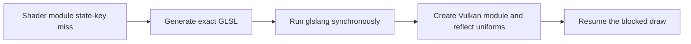
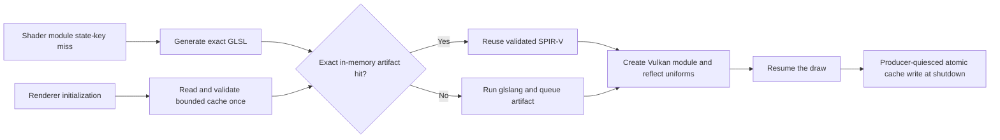

# feature/vulkan-spirv-prewarm

**Status:** Investigating
**Stable baseline:** `9f618d6d8c4c446ef023955f3d4de22f661f61a4` / retained product executable `3489fdcc593e942b92a612bf35a98f509ff0907e3370e1e5f45f2972d83fb16b`
**Previous main:** `e18ba8d6274cf227cc9e5ae1b5684f28ed911a99`
**Current candidate:** Pending implementation on this branch

## Summary

**Current result:** Cause confirmed; behavioral implementation and testing are pending.

**Headline:** The measured PGR2 hitch compiled four first-seen shaders and spent
18.217 ms in glslang. Reusing validated SPIR-V loaded before gameplay can
remove that compilation from a warm run without changing shader state.

**Next:** Implement a bounded, versioned cache with no gameplay-path file I/O,
then compare cold, warm, and same-process runs before starting the complete
product matrix.

## Investigation

### Why this patch exists

The completed PR #68 diagnostic recorded 141 Vulkan stage-module misses and
463.419 ms of glslang work during one PGR2 snapshot run. The primary hitch at
guest frame 673 contained two vertex and two fragment misses. All four were
new generated sources in that process and consumed 18.217 ms in glslang.

Twenty other misses regenerated stage/source identities already seen under a
different state key, costing another 68.200 ms. Key normalization is useful
follow-up work, but it cannot remove the four first-seen compilations in the
primary hitch.

### Patch hypothesis

Load a bounded SPIR-V artifact index during Vulkan renderer initialization.
On a module-cache miss, generate the exact GLSL as today and look up a record
identified by stage, exact source bytes, shader-generator/cache schema, target
environment, and compiler options. A validated hit supplies SPIR-V from
memory; a miss uses glslang and queues the resulting artifact for a single
producer-quiesced, atomic write outside gameplay.

The first candidate intentionally retains GLSL generation, Vulkan module
creation, and reflection. The measured primary frame spent 0.797 ms generating
GLSL, 0.043 ms creating modules, and 1.269 ms reflecting them, compared with
18.217 ms compiling. Precreating complete modules is a later step if warm-run
tail measurements show the remaining work matters.

Risks include accepting stale or corrupt cache data, confusing compiler and
generator identities, unbounded disk/RAM growth, file I/O on the draw path,
incorrect SPIR-V lifetime, and failed-cache behavior that prevents the normal
compiler fallback.

## Processing flow

### Current / before

### Candidate / after

### Processing difference

| Area | Current | Candidate | Expected effect |
| --- | --- | --- | --- |
| Draw-path compilation | glslang on every process-first source | Memory lookup on a valid warm hit | Remove measured compiler stall |
| File I/O | None | Initialization read and shutdown write | No gameplay-path file I/O |
| GPU work | Create the same Vulkan module | Create the same Vulkan module from identical SPIR-V | Equivalent GPU input |
| Memory | In-process modules only | Bounded validated artifact index | Measured and capped increase |
| Failure | Compilation failure is visible | Invalid/missing cache falls back to the same compiler path | Preserve current behavior |

## Code changes

- A single little-endian `spirv-v1.bin` file under the settings-owned
  `cache/vulkan` directory carries an explicit cache ABI, shader-generator
  policy revision, glslang semantic version and flavor, Vulkan/SPIR-V targets,
  every effective debug/compiler-policy flag, and per-record stage plus exact
  GLSL bytes. Hashes accelerate comparison and validate payload integrity;
  exact bytes remain authoritative.
- The cache independently caps records at 4,096, one source and one SPIR-V
  module at 1 MiB each, aggregate source bytes at 16 MiB, aggregate SPIR-V
  bytes at 32 MiB, and the complete file at 64 MiB. SPIR-V length, word
  alignment, magic, and version are checked before an entry becomes visible.
- Vulkan initialization reads and transactionally validates the file once.
  Graphics module misses generate GLSL as before and perform only an in-memory
  lookup. Missing, incompatible, truncated, corrupt, or oversized input leaves
  the empty/current store usable and falls through to glslang.
- Cached and freshly compiled bytes enter one fallible module-construction
  path that creates device-owned `VkShaderModule` and SPIRV-Reflect state once.
  A cached construction failure removes that entry, fully unwinds its partial
  resources, compiles normally, and queues the successful immutable artifact.
- Clean shutdown queues one producer-thread write after rendering mutations
  quiesce. The complete replacement is serialized in memory, written to a
  uniquely named temporary file, and atomically renamed. Write or rename
  failure leaves the previous cache intact and remains retryable. Renderer
  switches synchronously publish dirty entries from the quiesced producer
  before destroying the renderer-local store.
- The live shader-cache toggle gates lookup, queuing, and writeback. Turning it
  off stops cache work immediately. A Vulkan renderer created while caching is
  disabled remains ineligible for cache use and publication, so enabling takes
  effect after a renderer restart and cannot replace an unseen cache file.
- One deferred shutdown line reports aggregate hits, misses, rejections,
  fallbacks, records, source/SPIR-V bytes, loaded/queued bytes, and write
  outcome. Shader misses do not log.

**Main code path:** `hw/xbox/nv2a/pgraph/vk/glsl.c`, `shaders.c`, Vulkan
renderer lifecycle, and a focused cache-format module.

## Known limitations

- GLSL generation, Vulkan module creation, and reflection remain synchronous;
  this candidate targets the measured glslang region only.
- Concurrent xemu processes use unique temporary files and always publish a
  valid bounded file, but the last clean shutdown wins; their in-memory record
  sets are not merged.
- A renderer that starts with shader caching disabled does not preload the file
  and cannot use or publish its empty store. This avoids module-miss file I/O
  and preserves an existing cache, at the cost of requiring renderer
  reinitialization after enabling the setting.
- SPIRV-Reflect is the available parser; this tree does not expose SPIRV-Tools
  validation. Cache inputs are size-, integrity-, stage-, entry-point-, and
  layout-checked, with bounded descriptor/member counts and checked uniform
  address arithmetic before Vulkan creation, but this is structural validation
  rather than a complete `spirv-val` pass.
- The inherited successful-layout allocation leak remains tracked by issue
  #69. This change frees only partial allocations created by a rejected cached
  module; eviction and renderer-switch resource qualification still depend on
  resolving or explicitly accepting that separate gate.

## Profiling

| Measurement | Stable baseline | Previous main | Current candidate |
| --- | ---: | ---: | ---: |
| PGR2 primary-frame glslang | Retained run does not contain this diagnostic | 18.217 ms diagnostic target | Pending |
| Full-run glslang | Retained run does not contain this diagnostic | 463.419 ms diagnostic target | Pending |
| First stage/source identities | Not recorded | 121 | Pending |
| Different-key/same-source compiles | Not recorded | 20 | Pending |

The instrumentation result identifies the cause; it is not a baseline or
candidate performance qualification.

## Performance results

Every percentage is Improvement %: positive is favorable and negative is
unfavorable. Interval, CPU-time, memory, and stall metrics are `+bad`; FPS and
completed work are `+good`.

| Workload | Renderer | Metric | Raw + | Stable | Previous main | Candidate | Improvement vs stable | Improvement vs previous main |
| --- | --- | --- | --- | ---: | ---: | ---: | ---: | ---: |
| PGR2 snapshot warm | Vulkan | maximum interval | `+bad` | Pending reuse | Pending reuse | Pending | N/A | N/A |
| PGR2 snapshot warm | Vulkan | primary-frame glslang | `+bad` | N/A | 18.217 ms diagnostic | Pending | N/A | N/A |
| PGR2 full start | Vulkan/OpenGL | average, p95, p99, maximum, stalls | `+bad` | Pending reuse | Pending | Pending | N/A | N/A |
| Morrowind snapshot | Vulkan/OpenGL | average, p95, p99, maximum, stalls | `+bad` | Pending reuse | Pending | Pending | N/A | N/A |

## XISO results

| Gate | OpenGL | Vulkan |
| --- | --- | --- |
| Focused cache format and failure injection | Not needed | Not run |
| Full catalog and output oracle | Not run | Not run |
| Validation errors | Not needed | Not run |

## Resource results

| Metric | Raw + | Stable | Previous main | Candidate | Improvement vs stable | Improvement vs previous main |
| --- | --- | ---: | ---: | ---: | ---: | ---: |
| Cache RAM bytes | `+bad` | 0 | 0 | Pending | N/A | N/A |
| Cache disk bytes | `+bad` | 0 | 0 | Pending | N/A | N/A |
| Startup cache-read time | `+bad` | 0 | 0 | Pending | N/A | N/A |
| Shutdown cache-write time | `+bad` | 0 | 0 | Pending | N/A | N/A |

## Correctness

The same GLSL must produce byte-identical accepted SPIR-V on cache miss and
subsequent hit for the pinned compiler policy. Corrupt, truncated, oversized,
unknown-version, incompatible, and unwritable cache cases must fall back to
normal compilation without losing a draw or leaving partial state. OpenGL must
remain unchanged.

## Validation status

| Test | OpenGL | Vulkan |
| --- | --- | --- |
| Targeted patch and corruption/failure tests | Not needed | Not run |
| Cold/warm/same-process shader corpus | Not needed | Not run |
| Profiling comparison | Not needed | Not run |
| Resource comparison | Not needed | Not run |
| Morrowind snapshot | Not run | Not run |
| PGR2 full start | Not run | Not run |
| PGR2 snapshot | Not run | Not run |
| Full XISO | Not run | Not run |
| Final visual validation | Not run | Not run |

A single valid unexplained regression over 2%, including p95, p99, maximum,
or stalls, keeps the candidate on hold.

## Tradeoffs and decision

**Result:** Continue investigation.

No performance improvement is claimed. The initial focused gate must prove
that a warm hit removes glslang work, cache failures preserve output, and
startup/shutdown costs and storage remain bounded. Only then does the exact
candidate proceed to the full XISO, PGR2 full-start and snapshot, and
Morrowind snapshot matrix on both renderers.

## Evidence

- [Complete shader identity report](https://github.com/Mainkill1/xemu-perf-tests/blob/e77436eb3f7084bd8e406e07ede7ec5f318d1e66/docs/evidence/pr68-shader-identity-20260910/classification/REPORT.md)
- [Repository workflow](../repository-workflow.md)
- [Performance PR template](../../evidence/wiki-xiso-per-test/PERFORMANCE_PR_TEMPLATE.md)

## Final summary

The diagnostic proves the primary PGR2 hitch spends 18.217 ms compiling four
first-seen shaders. This branch will test bounded, validated, preloaded SPIR-V
reuse as one focused behavioral change. Implementation, correctness, resource,
and performance results are pending.
