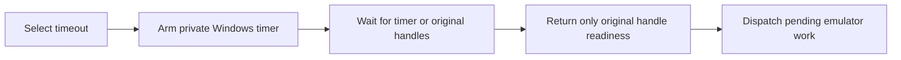

# Windows short-wait investigation

Status: **held; qualification incomplete**. This records completed diagnostics,
not an accepted XISO speedup or a complete PGR2 lag fix. Related work:
[issue 19](https://github.com/Mainkill1/xemu/issues/19) and
[PR 24](https://github.com/Mainkill1/xemu/pull/24).

## Change and integration scope

The Windows short-wait path used to repeatedly read the clock until its timeout.
The candidate waits on a persistent high-resolution timer together with the
original event handles. Necessary device timers and guest time are unchanged.

The production extraction is `1945c40dd7d0c501949f3ab8820f0202f0fe6bd4`
on frozen S `208e4596832a1f949bd63822d5ddd962c4575067`. It excludes
research PTIMER, QPC and attribution changes. Exact executable identities are
in [build-identities.json](build-identities.json). Marker-validation identities
are separate: both sides add the same existing opt-in XISO harness. They must
not be described as the uninstrumented production heads.

Builds use matching Windows Release settings, full LTO, x86-64-v3, and toolchain
`ghcr.io/xemu-project/xemu-win64-toolchain-gcc@sha256:09fdc183a88b493bf3a98d0d00b03aca4d5a23e60cc08228d7752d3c3295e8b2`.

## Morrowind: frozen S versus wait-only

One 60-second capture per build/renderer. The fixed snapshot was restored;
QMP running, wait 5 seconds, Start held 150 ms, wait 2 seconds, B held 150 ms,
wait 2 seconds, then uninterrupted measurement. No resource sampler in these
cells. Each used private writable state and verified immutable-seed cleanup.
Reviewed end images showed the intended scene without the reconnect/pause menu.
A nonblank image alone is not a gameplay oracle.

| Renderer | Build | Cadence FPS | p95 ms | p99 ms | Maximum ms | Gaps >75 ms |
|---|---|---:|---:|---:|---:|---:|
| Vulkan | S | 28.424 | 41.385 | 47.826 | 78.443 | 1 |
| Vulkan | Wait-only | 27.819 | 43.114 | 48.615 | 75.277 | 1 |
| OpenGL | S | 37.301 | 32.845 | 38.024 | 46.356 | 0 |
| OpenGL | Wait-only | 38.441 | 31.480 | 37.009 | 45.844 | 0 |

Cadence is NV2A display-write activity, **not displayed FPS**. Vulkan cadence was
2.13% lower and OpenGL 3.06% higher in these single pairs. Neither is a
statistically established performance change. No interval exceeded 150 ms.

[Full measurements](morrowind-s-wait.csv),
[long intervals](morrowind-s-wait-gaps.csv).

## Morrowind: research-profiling negative control

All four captures used the identical research executable from
`8cabc23d9edda3b2a12a6d64983bcec076237fdc`, identical Vulkan configuration,
snapshot and Start/B sequence, and no resource sampler. The only selected
change was `XEMU_QEMU_POLL_PROFILE=1` versus `0`.

| Order | Profiling | Cadence FPS | p95 ms | p99 ms | Gaps >75 ms | Gaps >150 ms |
|---:|---|---:|---:|---:|---:|---:|
| 1 | On | 24.599 | 47.773 | 171.228 | 29 | 27 |
| 2 | Off | 28.303 | 42.041 | 47.522 | 0 | 0 |
| 3 | Off | 28.448 | 42.468 | 47.682 | 1 | 0 |
| 4 | On | 25.984 | 44.408 | 174.167 | 29 | 28 |

Profiling repeatedly triggered the approximately 2.1-second stall pattern in
this configuration. The recording paths synchronously emitted diagnostic
batches during emulation. Research repair
`172c4bd80a2e4583e39b83190a4a6807d8ab9115` removes automatic emission and
retains explicit reset/flush controls. A compiled source test failed before
that repair and passes after it under ASan/UBSan; native repair validation is
still pending. This does not establish the cause of every earlier freeze.

[Full measurements](morrowind-profile-on-off.csv),
[every long interval](morrowind-profile-on-off-gaps.csv).

## XISO production Vulkan: diagnostic comparison

Both sides passed all 149 records in two full passes. No records were dropped.
The 144 leaf records contribute to time sums; five aggregate records contribute
to correctness counts but are excluded from sums to prevent double counting.

| Measurement | S | Wait-only | Observation |
|---|---:|---:|---|
| Sum of mean leaf test times | 100.642 s | 99.784 s | 0.85% lower |
| Mean host wall time | 140.252 s | 133.733 s | Includes runner/startup overhead |
| Mean host CPU capacity used | 17.63% | 12.66% | Lower CPU use |
| Mean process GPU engine sum | 72.59% | 73.42% | Higher |
| Mean device GPU utilization | 32.00% | 34.76% | Higher |
| Mean process private bytes | 3,025,643,985 | 3,045,234,981 | Higher |

These production binaries lack live timing boundaries. The measurements are
**diagnostic, not a qualified speedup**. Resource samples cover the launch/run,
not a precisely isolated guest measurement phase. The process GPU engine sum
and device utilization measure different things; neither is GPU power.

Unfavorable leaf observations include Dxt1DirtyOnceRedraw +12.09%,
Pgr2AiBackup StreamingOnly +11.55%, Dxt1RingPayloadGenerations +11.00%,
SurfaceListLookup002 +8.28%, and UniformThrash +7.73%. Signed changes describe
these runs; no sign-only improvement/regression classification is applied.

[Per-test comparison](xiso-vulkan-production-per-test.csv),
[baseline full timing rows](xiso-vulkan-production-baseline.csv),
[candidate full timing rows](xiso-vulkan-production-candidate.csv),
[baseline resources](xiso-vulkan-production-baseline-resources.csv),
[candidate resources](xiso-vulkan-production-candidate-resources.csv).

## Exclusions and remaining gates

Two PGR2 captures were falsely marked complete while still in menus:
the research control/OpenGL at Select Transmission (56.981 FPS), and a later
research candidate/OpenGL at Start Race (58.907 FPS). Both are excluded from
race comparisons. Menu animation and successful key injection are not proof
that the target gameplay state was reached. The original PFIFOSaturation stall
also remains unexplained despite successful later reproduction attempts.

Required before acceptance: finish both-renderer XISO comparisons with valid
marker timing, inspect unfavorable per-test results, qualify the repaired
profiling head natively, verify full-start PGR2 gameplay, and complete repeated
production CPU/frame-time comparisons. The previous large CPU savings from a
different research head do not qualify this extraction or prove faster XISO
completion. Keep the lane held until these requirements are satisfied.
