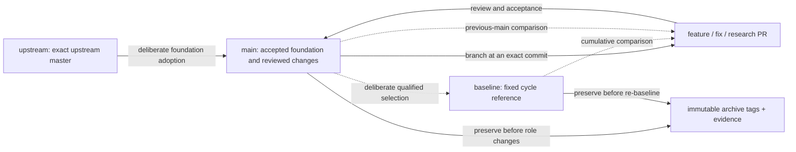

# Repository workflow

The owner selected existing `main` at `bd1fecb93353272dda2a810991e28945de35b665` as the stable, accepted foundation for cycle 01. `baseline` pins that source; `main` carries it forward through reviewed PRs. Its existing known fixes and testing addons remain included. The [inventory](repository-normalization.md) records exact source and evidence identities.

| Branch | Purpose | Update rule |
| --- | --- | --- |
| `upstream` | Untouched `xemu-project/xemu:master` | Advance to the exact upstream commit; never add local patches or documentation here. Archive the old pin before changing an active cycle's foundation. |
| `baseline` | Fixed, validated comparison source for one declared optimization cycle | Select deliberately with exact source, executable and test/result identities. Keep fixed across optimizations. Preserve its prior source and results before any deliberate re-baseline. |
| `main` | Accepted carry-forward product changes | Merge reviewed fixes and optimizations through PRs. A candidate or diagnostic branch does not become accepted through cleanup. |
| `feature/*`, `fix/*`, `research/*` | Focused work from `main` | Open a PR early; identify dependencies, goal, baseline, measurements and disposition. Preserve useful failures and attribution. |

There is no permanent product `test` branch. Permanent product tests stay with maintained code. Reusable validation in [xemu-perf-tests](https://github.com/Mainkill1/xemu-perf-tests) should accept an exact upstream, baseline, main or candidate source/binary, using the same pinned test revision and settings for each comparison.

## Select and advance a baseline

A baseline record names the source commit and tree, executable hash, build/toolchain, test revision/catalog, settings/workloads, result manifest and known correctness limits. A branch name or a copied report is insufficient. A source-equivalent merge may reuse a retained binary only when the matching code/tree identity is proven and the binary's actual compiled-source identity remains visible.

Understand the intended correctness state before choosing the reference. A known negative control, an incomplete result and a passed workload must be labeled separately. Newly discovered test failures do not erase valid historical comparisons; preserve the old test revision/results and run the new revision on both baseline and candidate. Do not relabel historical evidence as qualification of a different source or test plan.

Re-baseline only for an explicit reason: adopting a new upstream foundation, closing a defined optimization cycle, or accepting a correctness repair that changes the valid reference. Before moving `baseline`, archive the old commit and results, record the reason and new qualification scope, and start a new cycle entry. Do not move it after every optimization.

The machine-readable [baseline selection record](performance/baseline-selection.json) is authoritative for whether a baseline has actually been selected. It records the owner-selected cycle 01 source and retained binary/results; `baseline` is not a moving alias for `main`.

## Record both comparisons for accepted changes

Every accepted patch records:

1. **Candidate versus previous main:** incremental effect of that patch, with previous-main and candidate SHAs/binaries.
2. **Candidate versus baseline:** cumulative effect within the cycle, with the fixed baseline SHA/binary.

Use the same test revision, configuration, workload and measurement method for each pair. Reuse matching baseline records; collect missing reference measurements once and retain them. If an accepted correctness fix made the old reference unable to complete a workload, record that failure and mark the timing delta unavailable rather than inventing a percentage.

Summaries use clean tables. Include per-test outcomes, guest work completed, timing/tails, measured CPU/GPU/memory resources, correctness/visual checks, unfavorable results, and uncertainty. Distinguish guest cadence from rendered FPS. Keep diagnostic timing separate from production timing. Correctness-only tests remain acceptance gates without becoming performance scores. Missing or inconclusive measurements are not an improvement claim.

The [accepted-change ledger](performance/accepted-changes.json) records source/evidence identities and explicitly missing comparisons. Historical patches are part of the accepted initial foundation; their individual performance effects without matched measurements remain unknown; normalization does not reconstruct causal speedups from unrelated tables.

## Preserve tests, diagnostics and evidence

- Product tests, reusable diagnostics, automation and compact code-linked documentation belong in maintained repositories and reviewed PRs.
- Put large/raw runs, complete per-test tables, symbol packages and one-off captures in durable release artifacts or an evidence repository. PRs link exact manifests/checksums and summarize conclusions. Never commit game images, writable disks, credentials or personal machine configuration.
- Preserve existing evidence-bearing history. Do not rewrite old commits merely to move their logs out of source history. Future work should use the artifact layout above.
- Keep failed experiments with source/tool/test identities, the observed failure, its interpretation and the reason for rejection/hold. A closed PR remains useful evidence.
- Before deleting a working branch, verify that its useful commits are reachable from an accepted branch or an immutable archive tag; preserve PR descriptions, reviews, attribution, reports and artifact links. Verify recovery from the archive. An unresolved candidate, stacked review parent, or evidence-only head may need to remain indefinitely.

Use `archive/YYYY-MM-DD/<descriptive-name>` for immutable preservation tags. These are historical snapshots, not acceptance labels. Prefer normal commits/PRs over force-pushing or replacing useful history. Do not rename or rewrite stacked PR branches merely to satisfy a naming convention; document their historical role and use the canonical names for new work.

See the [preservation inventory](repository-normalization.md) for exact archive tags, branch identities and PR dispositions.

## Current normalization status

The initial audit preserved current main, pre-APU Full-Speed history, frozen S, the blocked release proposal and significant PR heads. The owner then explicitly selected current main as the stable baseline. The [baseline release](https://github.com/Mainkill1/xemu/releases/tag/baseline-bd1fecb9-20260909) supplies the retained binary, source and diagnostic symbols. No upstream adoption or Stable-tree replacement occurs in this normalization.

PR [#59](https://github.com/Mainkill1/xemu/pull/59) remains a blocked current-main PTIMER candidate. Its native timer controls pass and old-code failures are reproduced, but remaining compatibility/performance gates are not complete. PR [#51](https://github.com/Mainkill1/xemu/pull/51) remains a blocked release-tree proposal with unresolved concerns. Neither is included by normalization.

Known current-reference gates are tracked in [report bounds #60](https://github.com/Mainkill1/xemu/issues/60), [snapshot controller #61](https://github.com/Mainkill1/xemu/issues/61), [full-suite selection](https://github.com/Mainkill1/xemu-perf-tests/issues/10) and [evidence transport](https://github.com/Mainkill1/xemu-perf-tests/issues/11). Their existence does not invalidate unrelated historical measurements; it limits what the current campaign can claim.

Cycle 01 begins with identical product source in `main` and `baseline`; this normalization adds documentation only. Upstream adoption is a future deliberate action, not part of this cycle setup.
