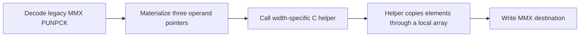
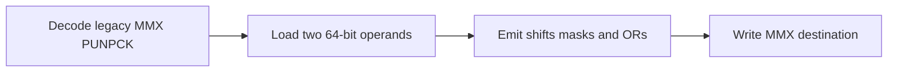

# x86 MMX unpack fast-path design

## Problem

PGR2 full-launch gameplay is stable near 25 FPS on Steam Deck with either
renderer. A clock-correct xemu JIT profile maps the hottest guest translation
block to `default.xbe` address `0x211ba7`. That address is the loop head of an
XMV pixel conversion routine dominated by legacy 64-bit MMX `PUNPCKLBW`,
`PUNPCKHBW`, `PUNPCKLWD`, and `PUNPCKHWD` instructions.

The 213-byte guest loop translates to about 5,972 bytes of x86-64 host code.
The current decoder calls C helpers for each MMX unpack instruction. This
materializes pointers to the MMX operands, crosses the helper ABI, and prevents
TCG from optimizing the unpack together with adjacent operations. The same
decoder already emits direct gvec IR for the loop's `PXOR` and `POR` operations.

## Scope

Specialize only the six legacy 64-bit MMX unpack forms:

- `PUNPCKLBW` / `PUNPCKHBW`
- `PUNPCKLWD` / `PUNPCKHWD`
- `PUNPCKLDQ` / `PUNPCKHDQ`

SSE, AVX, and AVX-512 forms retain their existing helpers. No game address,
title ID, renderer, or host-architecture check is introduced.

## Proposed translation

Load both 64-bit MMX inputs into TCG scalar temporaries before modifying the
destination. Select the low or high 32-bit half, then interleave with shifts,
masks, and ORs:

- byte forms spread four source bytes into alternating byte positions;
- word forms spread two source words into alternating word positions;
- dword forms combine one dword from each source.

Store the single 64-bit result to the decoded destination. Loading both inputs
first preserves the helper's aliasing behavior when destination and source are
the same register.

## Processing flow

### Current

### Candidate

| Area | Current | Candidate | Expected effect |
| --- | --- | --- | --- |
| CPU work | Helper call plus element loops | Direct integer IR | Smaller and optimizable TB |
| State traffic | Pointer operands and helper boundary | Two loads and one store | Less CPU-state traffic |
| Guest semantics | Element interleave | Same bit-exact interleave | No behavior change |

## Correctness requirements

- Cover low/high byte, word, and dword forms with focused known-value tests.
- Retain the existing generated MMX instruction suite.
- Verify register/register, destination aliasing, and memory-source cases.
- Confirm PGR2 follows the same full-launch route with complete guest-progress
  evidence on Vulkan and OpenGL.

## Performance gates

The first gate is an optimized Linux build and the exact Steam Deck Vulkan
full-launch route against stable main `83eeec715a`. Continue only if FPS or
frame cadence improves outside run variance. If promising, profile the same
window again and validate OpenGL, Windows, representative xiso coverage, and
the remaining rows in `PERFORMANCE_PR_TEMPLATE.md` before integration.

## Risks

- Bit ordering mistakes in high/low selection.
- Source/destination aliasing mistakes if a store occurs before both loads.
- Larger scalar IR on hosts where TCG cannot combine masks efficiently.

The focused semantics tests address the first two risks. Measured host code
size and cross-renderer benchmarks address the third.
