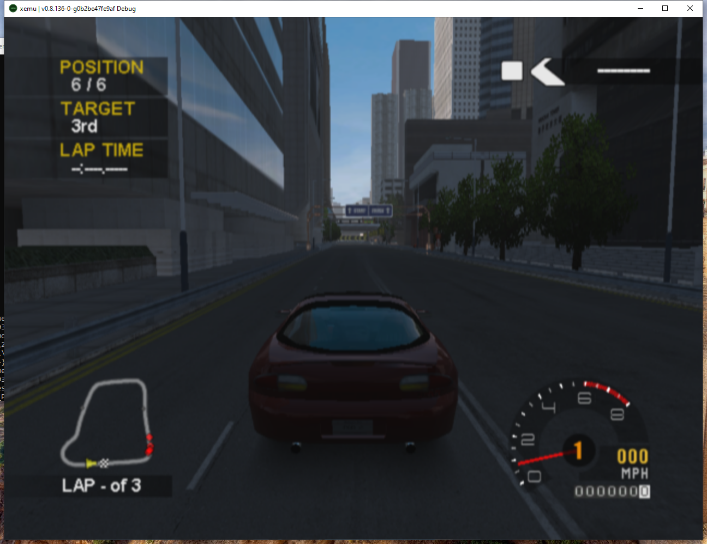
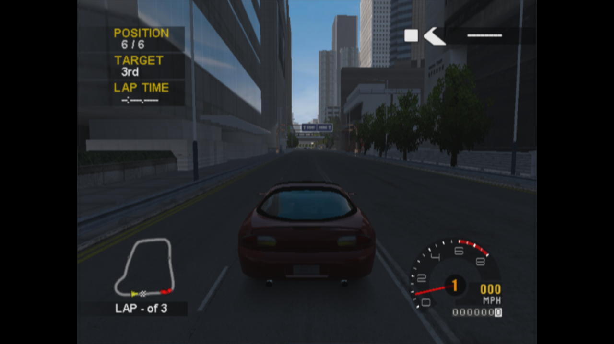

# Relative NV2A flip POC: native Windows and Steam Deck

## Result

The corrected stop mechanism passed the bounded native PGR2 diagnostic on both hosts. Each request was armed relative to the current guest READ_3D count, held PFIFO at a completed flip stall, paused the CPU through a main-loop bottom half, and waited for a matching acquisition/presentation generation before the authored screenshot. Both runs stopped after exactly 160 increments/stalls, then exactly 30 more, with no observed overshoot or additional READ_3D increments between quiesce and CPU pause.

Both show the same red player car parked at 0 MPH, in the same race/start-line location and chase camera. AI racers/minimap state differ, including before arming. The mechanism is demonstrated; **identical complete guest simulation state is not established**. The host-time menu route and host-time settle do not provide a shared simulation-time starting boundary. These runs cannot isolate intrinsic work per flip from those different initial states.

## Observed counters

All values below are relative arm-to-quiesce deltas. Elapsed means diagnostic host monotonic time; it is not an A/B performance result. Vblank means the existing NV2A VGA update callback that asserts PCRTC VBLANK. Present means a completed SDL or DXGI route; repeated images count, and neither physical scanout nor unique game images are established.

| Host | First READ_3D / completed stalls | Elapsed | Vblank callbacks | Presentation calls | Overshoot | Second increments / stalls | Second elapsed |
|---|---:|---:|---:|---:|---:|---:|---:|
| windows | 160 / 160 | 17.573892 s | 1054 | 17395 | 0 | 30 / 30 | 3.129160 s |
| deck | 160 / 160 | 11.715765 s | 703 | 1202 | 0 | 30 / 30 | 2.708419 s |

During a later paused interval, display activity continued while guest counters stayed fixed:

| Host | Query interval | READ_3D / stalls | Vblank delta | Presentation delta |
|---|---:|---:|---:|---:|
| windows | 2.861875 s | 0 / 0 | 171 | 5528 |
| deck | 2.828067 s | 0 / 0 | 170 | 6837 |

No generic multiplier is used. Refresh and repeated host presentation therefore cannot satisfy a guest-progress input gate.

## Screenshots

These are observed runner captures, not replay images. Different resolutions and window framing are preserved.

| Windows: +160 stop | Steam Deck: +160 stop |
|---|---|
|  |  |

The pre-arm checkpoint and +30 stop are also retained for [Windows](windows/) and [Deck](deck/).

## Lifecycle validation

- Both stop queries report `paused` and `presented-generation == generation` (1 then 2).
- Resume releases PFIFO and guest counters advance. Disarm releases PFIFO but leaves CPU paused; an explicit `cont` resumes it.
- A save attempted at the second paused stop cancels the request with reason `save`, returns “resume the VM before saving,” and rejects a second attempt while still paused. No snapshot is serialized by those rejected calls.
- Both procedures completed normally with exit 0. Both rigs were confirmed idle, controls inactive, queue pending count 0 afterward.
- The existing frame/flip logs were produced and retained privately. All QMP packets used for the assertions are published: [Windows](windows/probe-queries.json), [Deck](deck/probe-queries.json).
- Runner results report execution `completed`, evidence `complete`, correctness `notevaluated`, comparison `ineligible`. The explicit POC lifecycle assertions passed separately; these are not an accepted XISO correctness oracle or a benchmark qualification.

## Identity and implementation

Native-tested runtime commit `0b2be47fe9af1baa3f174d51a6ee0acb4a14b4da`, based on fork main `ee5ce48b48784f999af374c1452003f8b2b1230f`. Branch `experiment/nv2a-relative-flip-poc`, final code head `d6fabace38137d35312a82ec13b0fada97d63284`. The only later change registers the existing core assertions with the GLib/TAP test harness. Emulator runtime source is identical; native binary hashes and embedded versions remain those of `0b2be47`.

[Runtime-build CI](https://github.com/Mainkill1/xemu/actions/runs/36987622322) passed all 20 jobs. [Final test-harness CI](https://github.com/Mainkill1/xemu/actions/runs/36988514260) also passed all 20 jobs: 138 unit targets passed, 0 failed, 16 inherited skips; the separate required Mesa shader-depth draw check passed.

Both native binaries identify as `0.8.136-0-g0b2be47fe9af`, debug. Full SHA-256 values, procedure identity and source equivalence are in [build-identities.json](build-identities.json). Native summaries include exact run IDs and runner revisions: [Windows](windows/run-summary.json), [Deck](deck/run-summary.json).

The opt-in environment is `XEMU_NV2A_FLIP_PROBE=1`. QMP commands are `x-nv2a-flip-query`, `x-nv2a-flip-arm(delta)` and `x-nv2a-flip-disarm`. The gate belongs to `pfifo.lock`. PFIFO stops before the next guest method, while renderer synchronization remains runnable. The main-loop callback revalidates generation and VM state after `vm_stop()` can dispatch nested work. UI acquisition begins after the stopped generation is published; failed/drop/quarantined Windows routes cannot publish presentation evidence. Reset/load/save/shutdown cancel active requests, and resume releases a hold. Diagnostic state is not VMState.

```text
Before: process-start count -> vCPU stop request -> PFIFO wake -> later screenshot
After:  relative arm -> completed flip hold -> main-loop CPU pause
        -> post-pause acquisition -> completed presentation marker -> screenshot
```

Fork main's repaired PGRAPH control locking and frame/flip logging remain present. No CPU stop is performed in profile.c, and no new refresh generator was added.

## Procedure, costs and limits

The complete 48-step plan and QMP recipes are identical on both rigs. The original 23-step menu prefix hash is `81536823700a9d940f51b7e728cbc054b6e5dc263982e6ff785989f009fe4321`. Menu direction is 80 ms; other holds 100 ms. No acceleration. After the menu route, settle 30 host seconds, capture checkpoint, arm +160, inspect/hold/resume, arm +30, inspect/save/retry/disarm/resume/quit. These diagnostic waits are separate from the ordinary 30-second stationary benchmark and its minimum guest-sample threshold. [Windows procedure](windows/procedure.json), [Deck procedure](deck/procedure.json).

The same portable private HDD seed was used: 1,441,792 bytes, SHA-256 `7b0f55920d8740e9c77183392aad9969f775ba823f1de4612ef461796a055b52`. BIOS/EEPROM are not asserted equal, and Windows ISO content identity remains independently unqualified. Windows retains keyboard-backed input; Deck uses Linux uinput. Deck receipts establish OS submission, not guest consumption. Driver caches were uncontrolled. Both used the existing HTTP tester; Windows lacks completionWait, so its authored terminal result was read through supported status/artifact APIs. No baseline or normal benchmark changed.

With the experiment enabled, saves of a non-running VM are deliberately rejected until resume, including after disarm. The disabled snapshot path is unchanged. General paused-save ownership repair is separate. Nested callback races, failed presentation routes, repeated saves and core transitions are covered by focused production-path checks; [local validation](LOCAL-VALIDATION.md). The original runtime CI classified the no-output core assertion executable as skipped; the test-only correction emits proper TAP and the final run reports the core gate as OK, with one subtest passed. Other inherited suite skips/TAP warnings are not silently treated as passing checks.

This is a diagnostic POC, not a performance improvement or merge-ready upstream change. No affected/unaffected XISO timing campaign or capture-off/capture-on overhead comparison was performed, and no merge or release was made. Those gates remain for production use. Next determinism validation should use one compatible shared VM-state origin and retain guest virtual time at the completed flip boundary. Guest flips can protect input pacing using minimum monotonic exposure **and** qualifying relative progress; they are not a universal elapsed-game-time unit.

> Agent assistance: Codex / GPT-6. Public evidence contains screenshots, counters and procedure/identity records. No firmware, EEPROM, RAM, game resources, ISO or shader-cache payload is published.
