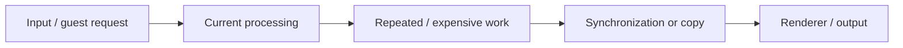
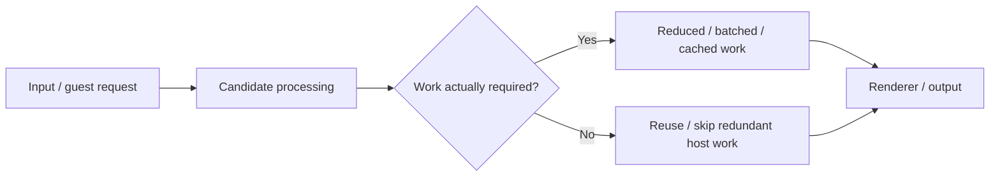

# <branch-name>

**Status:** Investigating / Testing / Promising / Failed / Heavy Regression / Ready to Integrate / Merged  
**PR:** <link>  
**Issue:** <link if applicable>

**Stable baseline:** `<commit>` / `<exe SHA-256>`  
**Prior candidate:** `<commit / branch / N/A>`  
**Current candidate:** `<commit>` / `<exe SHA-256>`

**Build:** `10.0.100.1`  
**Test:** `10.0.7.1`  
**Profile:** Official Windows Release (`build.sh`, full LTO, x86-64-v3)

---

## Summary

**Current result:**  
`<Example: Testing — Vulkan targeted tests show a consistent 6-9% improvement. OpenGL is neutral. Full validation has not started yet.>`

**Headline:**  
`<Most important measured result or current finding.>`

**Next:**  
`<Next test, code change, integration step, or reason work is stopping.>`

---

# Investigation

## Why This Patch Exists

**Observed problem:**  
<What is slow, wasteful, stalled, duplicated, over-synchronized, allocation-heavy, etc.?>

**Profiling evidence:**  
<What measurement led here? Include hot path, percentage, call rate, wait time, allocation count, GPU stall, trace finding, etc.>

**Suspected cause:**  
<What is actually causing the measured cost?>

**Why this is worth investigating:**  
<Why this path matters to Vulkan/xiso/game performance or host efficiency.>

## Patch Hypothesis

**What we plan to change:**  
<Describe the code/behavior change clearly.>

**Why it should be faster:**  
<Explain what work becomes cheaper, disappears, moves, batches, caches, becomes asynchronous, avoids synchronization, etc.>

**Expected result:**  
<What measurement should improve if the hypothesis is correct?>

**Possible risks:**  
<Correctness, ordering, synchronization, OpenGL behavior, memory use, visual differences, edge cases, etc.>

---

# Processing Flow

Replace the examples below with the actual affected path.

## Current

### Current behavior

1. `<what arrives>`
2. `<what processing occurs>`
3. `<where unnecessary/repeated work occurs>`
4. `<where CPU/GPU/memory/synchronization cost occurs>`
5. `<final output/state>`

## Candidate

### Candidate behavior

1. `<what remains unchanged>`
2. `<what changes>`
3. `<what work is removed/reused/batched/deferred>`
4. `<how synchronization/copies/allocations change>`
5. `<why output should remain equivalent>`

### Processing Difference

| Area | Current | Candidate | Expected Effect |
| --- | --- | --- | --- |
| CPU work | | | |
| GPU work | | | |
| Synchronization | | | |
| Copies | | | |
| Allocations | | | |
| Memory / VRAM | | | |
| Repeated work | | | |

Remove rows that do not apply.

---

# Code Changes

- `<change>`
- `<change>`
- `<change>`

**Main code path:** `<files/functions/subsystem>`

**Commits:** `<links>`

---

# Profiling

## Baseline Bottleneck

| Measurement | Stable Baseline | Prior Candidate | Current Candidate |
| --- | ---: | ---: | ---: |
| `<hot function / path>` | | | |
| `<calls/frame>` | | | |
| `<CPU time / samples>` | | | |
| `<GPU/stall measurement>` | | | |

**Profile evidence:** `<link>`

## After Patch

**Bottleneck status:** Improved / Removed / Unchanged / Worse / Still Testing

**What changed in the profile:**  
<Short measured explanation.>

**New limiting path:**  
`<new bottleneck / unchanged / not yet profiled>`

---

# Performance Results

## Headline Results

| Workload | Renderer | Stable | Prior | Candidate | vs Stable | vs Prior |
| --- | --- | ---: | ---: | ---: | ---: | ---: |
| `<main workload>` | Vulkan | | | | | |
| `<main workload>` | OpenGL | | | | | |
| `<second workload>` | Vulkan | | | | | |
| `<second workload>` | OpenGL | | | | | |

**Overall:**  
`<Example: Vulkan improves 8.4% vs Stable and 3.1% vs Prior. OpenGL is within run variance.>`

---

## Frame Performance

Use when applicable.

| Workload | Renderer | Metric | Stable | Prior | Candidate | vs Stable |
| --- | --- | --- | ---: | ---: | ---: | ---: |
| PGR2 | Vulkan | FPS / cadence | | | | |
| PGR2 | Vulkan | p95 | | | | |
| PGR2 | Vulkan | p99 | | | | |
| PGR2 | OpenGL | FPS / cadence | | | | |
| Morrowind | Vulkan | display-write cadence | | | | |
| Morrowind | Vulkan | p95 | | | | |
| Morrowind | Vulkan | p99 | | | | |
| Morrowind | OpenGL | display-write cadence | | | | |

Remove unused rows.

Morrowind snapshot FPS values are **guest display-write cadence**, not host-presented FPS.

---

# xiso Results

**Scope:** Targeted / Partial / Full  
**Repeats:** `<count>`  
**Cases:** `<passed>/<total>`

| Group / Family | Renderer | Stable | Prior | Candidate | vs Stable | vs Prior |
| --- | --- | ---: | ---: | ---: | ---: | ---: |
| `<group>` | Vulkan | | | | | |
| `<group>` | OpenGL | | | | | |

**Full per-test results:** `<CSV/raw evidence link>`

### Largest Improvements

| Test | Renderer | Stable | Candidate | Delta |
| --- | --- | ---: | ---: | ---: |
| | | | | |

### Largest Regressions

| Test | Renderer | Stable | Candidate | Delta |
| --- | --- | ---: | ---: | ---: |
| | | | | |

**Unstable / excluded:**  
`<tests and reason / None>`

---

# Resource Results

Use when collected or when the patch specifically targets host efficiency.

| Metric | Renderer | Stable | Prior | Candidate | Delta |
| --- | --- | ---: | ---: | ---: | ---: |
| Host CPU | Vulkan | | | | |
| Host GPU | Vulkan | | | | |
| RAM | Vulkan | | | | |
| VRAM | Vulkan | | | | |
| Host CPU | OpenGL | | | | |
| Host GPU | OpenGL | | | | |
| RAM | OpenGL | | | | |
| VRAM | OpenGL | | | | |

**Resource result:**  
`<Important efficiency improvement/regression/tradeoff.>`

---

# Correctness

| Check | OpenGL | Vulkan |
| --- | --- | --- |
| Functional | | |
| Hash / oracle | | |
| Validation errors | | |
| Visual output | | |
| Guest progression | | |
| Other | | |

Use `Not run — <reason>` when a check has not been performed.

**Correctness result:**  
`<No change / regression / unresolved difference / expected difference>`

---

# Validation Status

This table is the branch's test progress. Do not remove unfinished rows.

| Test | OpenGL | Vulkan |
| --- | --- | --- |
| Targeted patch test | Not run | Not run |
| Representative/partial xiso | Not run | Not run |
| Profiling comparison | Not run | Not run |
| Resource comparison, if relevant | Not run | Not run |
| Morrowind snapshot | Not run | Not run |
| PGR2 fresh-start | Not run | Not run |
| Full xiso | Not run | Not run |
| Final visual validation | Not run | Not run |

Use: `Pass`, `Regression`, `Neutral`, `Testing`, `Not run — <reason>`, or `Not needed — <reason>`.

**Investigating:** targeted OpenGL + Vulkan testing is enough to judge the idea.  
**Promising:** representative OpenGL + Vulkan testing, profiling, correctness, and relevant resource measurements should be complete.  
**Ready to Integrate:** run final validation once: full xiso OpenGL/Vulkan, Morrowind snapshot OpenGL/Vulkan, PGR2 fresh-start OpenGL/Vulkan, and final summarized performance/resource/correctness results.

---

# Tradeoffs / Regressions

**Performance regressions:**  
`
`

**Correctness regressions:**  
`
`

**Resource tradeoffs:**  
`<Example: -20% host GPU for -1.2% guest FPS / None>`

**Other concerns:**  
`
`

---

# Decision

**Result:** Continue / Revise / Integrate / Reject / Archive

**Why:**  
<Short measurement-based conclusion.>

**Integration path:**  
<How this reaches main, combines with another candidate, needs more work, becomes optional, etc.>

**Follow-up:**

- `<next action>`
- `<issue to open>`
- `<next optimization if applicable>`

---

# Evidence

- **Stable results:** `<link>`
- **Prior candidate results:** `<link / N/A>`
- **Candidate results:** `<link>`
- **Raw/per-test data:** `<link>`
- **Profiling:** `<link>`
- **Resource capture:** `<link>`
- **Visual evidence:** `<link>`
- **PR:** `<link>`
- **Issue:** `<link>`
- **Related Wiki:** `<link>`

---

# Final Summary

**Status:** `<Testing / Promising / Failed / Heavy Regression / Ready to Integrate / Merged>`

<2-5 sentences covering the measured reason for the patch, what processing changed, Stable → Candidate result, Prior → Candidate result when useful, important OpenGL/Vulkan regressions or tradeoffs, and what happens next.>
