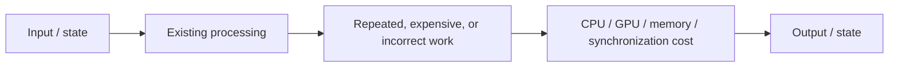
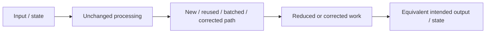

# <branch-name>

**Status:** Investigating / Testing / Promising / Failed / Heavy Regression / Ready to Integrate / Merged  
**PR:** <link>  
**Issue:** <link if applicable>

**Stable baseline:** `<commit>` / `<exe SHA-256>`  
**Prior candidate:** `<commit / branch / N/A>`  
**Current candidate:** `<commit>` / `<exe SHA-256>`

**Build:** `10.0.100.1`  
**Test:** `10.0.7.1`  
**Profile:** Official Windows Release (`build.sh`, full LTO, x86-64-v3)

---

## Summary

**Current result:**  
`<Example: Testing — Vulkan targeted tests show a consistent 6-9% improvement. OpenGL is neutral. Full validation has not started yet.>`

**Headline:**  
`<Most important measured result or current finding.>`

**Next:**  
`<Next test, code change, integration step, or reason work is stopping.>`

---

# Investigation

## Why This Patch Exists

**Observed problem:**  
<What is slow, wasteful, stalled, duplicated, over-synchronized, allocation-heavy, incorrect, etc.?>

**Profiling evidence:**  
<What measurement led here? Include hot path, percentage, call rate, wait time, allocation count, GPU stall, trace finding, correctness oracle, etc.>

**Suspected cause:**  
<What is actually causing the measured cost or incorrect behavior?>

**Why this is worth investigating:**  
<Why this path matters to Vulkan/xiso/game performance, correctness, or host efficiency.>

## Patch Hypothesis

**What we plan to change:**  
<Describe the code/behavior change clearly.>

**Why it should be faster:**  
<Explain what work becomes cheaper, disappears, moves, batches, caches, becomes asynchronous, avoids synchronization, etc. If this is a correctness patch with no speed hypothesis, say that directly and state the required performance-neutral gate.>

**Expected result:**  
<What measurement or correctness result should improve if the hypothesis is correct?>

**Possible risks:**  
<Correctness, ordering, synchronization, OpenGL behavior, memory use, visual differences, edge cases, etc.>

---

# Processing Flow

This section explains the behavioral/data path **before and after the patch** so a reviewer can understand the change without reading the diff first.

Use **two Mermaid flowcharts** whenever the patch changes how work or data moves through the system:

1. **Current / Before** — show the existing path and identify where the problem, repeated work, wait, copy, allocation, cache miss, or incorrect behavior occurs.
2. **Candidate / After** — show the proposed path using the same start/end points and the same node names for unchanged stages where possible. Make the removed, reused, batched, deferred, cached, or corrected work obvious.

Do not replace a real processing flow with a numbered list. Keep the charts focused on behavior rather than every function call. Show CPU/GPU boundaries, synchronization, copies, allocations, hashing/cache work, or data ownership when they are relevant. If processing flow truly does not apply, write `Not needed — <reason>`.

## Current / Before

The **Current / Before** chart should make it possible to point at the exact stage being investigated.

## Candidate / After

The **Candidate / After** chart should show what changed and why the output remains equivalent or becomes correct.

### Processing Difference

| Area | Current | Candidate | Expected Effect |
| --- | --- | --- | --- |
| CPU work | | | |
| GPU work | | | |
| Synchronization | | | |
| Copies | | | |
| Allocations | | | |
| Memory / VRAM | | | |
| Repeated work | | | |

Remove rows that do not apply. The table summarizes the two diagrams; it does not replace them.

---

# Code Changes

- `<change>`
- `<change>`
- `<change>`

**Main code path:** `<files/functions/subsystem>`

**Commits:** `<links>`

---

# Profiling

## Baseline Bottleneck

| Measurement | Stable Baseline | Prior Candidate | Current Candidate |
| --- | ---: | ---: | ---: |
| `<hot function / path>` | | | |
| `<calls/frame>` | | | |
| `<CPU time / samples>` | | | |
| `<GPU/stall measurement>` | | | |

**Profile evidence:** `<link>`

## After Patch

**Bottleneck status:** Improved / Removed / Unchanged / Worse / Still Testing

**What changed in the profile:**  
<Short measured explanation.>

**New limiting path:**  
`<new bottleneck / unchanged / not yet profiled>`

---

# Performance Results

## Improvement Convention

Every percentage comparison in this report is **Improvement %**: positive is
good and negative is bad. The `Raw +` cell declares how a larger raw value is
treated so the sign cannot be misread.

| Raw + | Raw metric direction | Improvement % |
| --- | --- | --- |
| `+good` | Higher is better, such as FPS or completed work | `100 × (candidate / reference - 1)` |
| `+bad` | Lower is better, such as duration, frame time, CPU time, or memory use | `100 × (reference - candidate) / reference` |
| `N/A` | Context only or no desired direction | `N/A` with the tradeoff explained below the table |

Use the stable baseline or prior candidate named by the comparison as the
reference. Keep the raw reference and candidate values beside the normalized
percentage. If the reference is zero, report `N/A` unless the metric has a
documented domain-specific rule.

## Headline Results

| Workload | Renderer | Metric | Raw + | Stable | Prior | Candidate | Improvement vs Stable (+ good / - bad) | Improvement vs Prior (+ good / - bad) |
| --- | --- | --- | --- | ---: | ---: | ---: | ---: | ---: |
| `<main workload>` | Vulkan | | `+good` / `+bad` | | | | | |
| `<main workload>` | OpenGL | | `+good` / `+bad` | | | | | |
| `<second workload>` | Vulkan | | `+good` / `+bad` | | | | | |
| `<second workload>` | OpenGL | | `+good` / `+bad` | | | | | |

**Overall:**  
`<Example: Vulkan improves 8.4% vs Stable and 3.1% vs Prior. OpenGL is within run variance.>`

---

## Frame Performance

Use when applicable. Keep this table to the metrics needed to understand the decision; put the complete machine-generated row set in the linked CSV/raw evidence instead of flooding the PR body.

| Workload | Renderer | Metric | Raw + | Stable | Prior | Candidate | Improvement vs Stable (+ good / - bad) | Improvement vs Prior (+ good / - bad) |
| --- | --- | --- | --- | ---: | ---: | ---: | ---: | ---: |
| PGR2-snapshot | Vulkan | FPS / cadence | `+good` | | | | | |
| PGR2-snapshot | Vulkan | interval p95 | `+bad` | | | | | |
| PGR2-snapshot | Vulkan | interval p99 | `+bad` | | | | | |
| PGR2-snapshot | OpenGL | FPS / cadence | `+good` | | | | | |
| PGR2-fullstart | Vulkan | FPS / cadence | `+good` | | | | | |
| PGR2-fullstart | Vulkan | interval p95 | `+bad` | | | | | |
| PGR2-fullstart | Vulkan | interval p99 | `+bad` | | | | | |
| PGR2-fullstart | OpenGL | FPS / cadence | `+good` | | | | | |
| Morrowind | Vulkan | FPS / cadence | `+good` | | | | | |
| Morrowind | Vulkan | interval p95 | `+bad` | | | | | |
| Morrowind | Vulkan | interval p99 | `+bad` | | | | | |
| Morrowind | OpenGL | FPS / cadence | `+good` | | | | | |

Add maximum interval / stall rows when tail latency is part of the gate. Mark unused rows as N/A if needed; explain below why the tests were not run.

---

# xiso Results

**Scope:** Targeted / Partial / Full  
**Repeats:** `<count>`  
**Cases:** `<passed>/<total>`

| Group / Family | Renderer | Metric | Raw + | Stable | Prior | Candidate | Improvement vs Stable (+ good / - bad) | Improvement vs Prior (+ good / - bad) |
| --- | --- | --- | --- | ---: | ---: | ---: | ---: | ---: |
| `<group>` | Vulkan | Duration | `+bad` | | | | | |
| `<group>` | OpenGL | Duration | `+bad` | | | | | |

**Full per-test results:** `<CSV/raw evidence link>`

### Largest Improvements

| Test | Renderer | Metric | Raw + | Stable | Candidate | Improvement % (+ good / - bad) |
| --- | --- | --- | --- | ---: | ---: | ---: |
| | | Duration | `+bad` | | | |

### Largest Regressions

| Test | Renderer | Metric | Raw + | Stable | Candidate | Improvement % (+ good / - bad) |
| --- | --- | --- | --- | ---: | ---: | ---: |
| | | Duration | `+bad` | | | |

**Unstable / excluded:**  
`<tests and reason / None>`

---

# Resource Results

Use when collected or when the patch specifically targets host efficiency.

| Metric | Renderer | Raw + | Stable | Prior | Candidate | Improvement vs Stable (+ good / - bad) | Improvement vs Prior (+ good / - bad) |
| --- | --- | --- | ---: | ---: | ---: | ---: | ---: |
| Host CPU time per fixed work | Vulkan | `+bad` | | | | | |
| Host GPU time per fixed work | Vulkan | `+bad` | | | | | |
| RAM | Vulkan | `+bad` | | | | | |
| VRAM | Vulkan | `+bad` | | | | | |
| Host CPU time per fixed work | OpenGL | `+bad` | | | | | |
| Host GPU time per fixed work | OpenGL | `+bad` | | | | | |
| RAM | OpenGL | `+bad` | | | | | |
| VRAM | OpenGL | `+bad` | | | | | |

**Resource result:**  
`<Important efficiency improvement/regression/tradeoff.>`

---

# Correctness

| Check | OpenGL | Vulkan |
| --- | --- | --- |
| Functional | | |
| Hash / oracle | | |
| Validation errors | | |
| Visual output | | |
| Guest progression | | |
| Other | | |

Use `Not run — <reason>` when a check has not been performed.

**Correctness result:**  
`<No change / regression / unresolved difference / expected difference>`

---

# Validation Status

This table is the branch's test progress. Do not remove unfinished rows.

| Test | OpenGL | Vulkan |
| --- | --- | --- |
| Targeted patch test | Not run | Not run |
| Representative/partial xiso | Not run | Not run |
| Profiling comparison | Not run | Not run |
| Resource comparison, if relevant | Not run | Not run |
| Morrowind snapshot | Not run | Not run |
| PGR2 fresh-start | Not run | Not run |
| Full xiso | Not run | Not run |
| Final visual validation | Not run | Not run |

Use: `Pass`, `Regression`, `Neutral`, `Testing`, `Not run — <reason>`, or `Not needed — <reason>`.

**Investigating:** targeted OpenGL + Vulkan testing is enough to judge the idea.  
**Promising:** representative OpenGL + Vulkan testing, profiling, correctness, and relevant resource measurements should be complete.  
**Ready to Integrate:** run final validation once: full xiso OpenGL/Vulkan, Morrowind snapshot OpenGL/Vulkan, PGR2 fresh-start OpenGL/Vulkan, and final summarized performance/resource/correctness results.

---

# Tradeoffs / Regressions

**Performance regressions:**  
`
`

**Correctness regressions:**  
`
`

**Resource tradeoffs:**  
`<Example: -20% host GPU for -1.2% guest FPS / None>`

**Other concerns:**  
`
`

---

# Decision

**Result:** Continue / Revise / Integrate / Reject / Archive

**Why:**  
<Short measurement-based conclusion.>

**Integration path:**  
<How this reaches main, combines with another candidate, needs more work, becomes optional, etc.>

**Follow-up:**

- `<next action>`
- `<issue to open>`
- `<next optimization if applicable>`

---

# Evidence

- **Stable results:** `<link>`
- **Prior candidate results:** `<link / N/A>`
- **Candidate results:** `<link>`
- **Raw/per-test data:** `<link>`
- **Profiling:** `<link>`
- **Resource capture:** `<link>`
- **Visual evidence:** `<link>`
- **PR:** `<link>`
- **Issue:** `<link>`
- **Related Wiki:** `<link>`

---

# Final Summary

**Status:** `<Testing / Promising / Failed / Heavy Regression / Ready to Integrate / Merged>`

<2-5 sentences covering the measured reason for the patch, what processing changed, Stable → Candidate result, Prior → Candidate result when useful, important OpenGL/Vulkan regressions or tradeoffs, and what happens next.>
